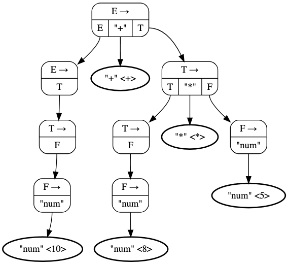

# Theory of Parsers

A parser receives a string of tokens from the lexer and verifies that
the given string of tokens can be constructed by the grammar of source language.
We want a parser to report any syntax errors in an actionable fashion and
to recover from common errors to continue parsing the rest of the source program.

The construction of the *abstract syntax tree* need not to be explicit,
since translation actions can be interspersed with parsing.

In general, there are three classes of parsers:

  - **Universal**
  - **Top-Down**
  - **Bottom-Up**

Universal parsing techniques can parse any grammar, but they are too expensive for real-world problems.
The most efficient top-down and bottom-up parsers only work for a sub-classes of grammars.
Several of these sub-classes, particularly **LL** and **LR** grammars,
are expressive enough to describe today's programming languages.

Hand-implemented parsers usually use LL grammars while
auto-generated parsers use a larger class of LR grammars.

```
                         ┌───────────────────┐                         ┌───────────────────┐
                         │     Top-Down      │                         │     Bottom-Up     │
                         └─────────┬─────────┘                         └─────────┬─────────┘
                                   │                                             │
                                   │                                             │
                         ┌─────────▼─────────┐                         ┌─────────▼─────────┐
                    ┌────┤ Recursive-Descent ├────┐                    │       LR(k)       │
                    │    └───────────────────┘    │                    └───────────────────┘
                    │                             │
                    │                             │
          ┌─────────▼─────────┐         ┌─────────▼─────────┐
          │    Backtracing    │         │  Non-Backtracing  │
          └─────────┬─────────┘         └─────────┬─────────┘
                    │                             │
                    │                             │
                    │                   ┌─────────▼─────────┐
                    │                   │    Predictive     │
                    │                   └─────────┬─────────┘
                    │                             │
                    │                             │
                    |    ┌───────────────────┐    |
                    └────▶       LL(k)       ◀────┘
                         └───────────────────┘
```

## Error-Recovery Strategies

It is very important to plan for the error handling right from the begining,
both at language design level and compiler design level.
We can describe the common programming errors using the following categories:

  - **Lexical errors**
  - **Syntactic errors**
  - **Semantic errors**
  - **Logical errors**

We want a parser to report errors clearly and accurately.
We also want it to recover from each error quickly enough, so it can detect additional errors.
If the number of errors exceeds from a limit,
it is better for the parser to stop rather than producing an avalanche of errors.
And all of that should not hurt the performance of parser significantly.

A few semantic errors, such as type mismatches, can be detected during parsing too.
In general, accurate detection of semantic and logical errors at compile time is not easy.

### Panic-Mode Recovery

In this method, when encountered with an error, the parser discards input symbols
one at a time until one of a designated set of *synchronizing tokens* is found.
The *synchronizing tokens* are well-defined symbols with clear and unambiguous role.

Using this method, the compiler designer need to select the *synchronizing tokens*.
Panic-mode often skips a considerable amount of input without checking it for additional errors;
however, it is a simple method and guaranteed not to go into an infinite loop.

### Phrase-Level Recovery

In the second method, the parser performs a local correction on the remaining input when discovering an error.
For example, it replaces the remaining input by a symbol that allows the parser to continue (replacing a comma with a semicolon).
The compiler designer must be cautious about the replacement since it can lead to infinite loop.

The major drawback of this method is the complexity when dealing with
a situation in which the actual error has occurred before the point of detection.

### Error Productions

Another appraoch would be anticipating common errors that might be encountered.
We can then augment the grammar with a set of auxiliary production rules that generate the erroneous constructs.
The parser can then generate appropriate error detections and corrections for the erroneous constructs.

### Global Correction

Ideally, we want our parser to make as few changes as possible when dealing with an incorrect input string.
There are algorithms for choosing a minimal sequence of changes to obtain a globally least-cost correction.
These optimization methods are too expensive in terms of time and memory complexities.

In fact, the notion of least-cost correction provides a benchmark for evaluating other practical error-recovery techniques.

## Context-Free Grammars

A context-free grammar **`G = (V, Σ, R, S)`** is defined by four sets:

  1. **`V`** is a set of **terminal** symbols from which *strings* are formed.
     Terminal symbols are also referred to as **tokens**.
  1. **`Σ`** is a set of **non-terminals** symbols that denote sets of strings.
     Non-terminal symbols are sometimes called **syntactic variables**.
     Non-terminals impose a hierarchical structure on the language.
  1. **`R = V × (V ∪ Σ)*`** is a set of **productions**, where each production consists of
     a non-terminal (*head*), an arrow, and a sequence of terminals and/or non-terminals (*body*).
  1. **`S ∈ V`** is one of the non-terminal symbols designated as the **start** symbol.
     The set of strings denoted by the start symbol is the language generated by the grammar.

In this document, we follow these conventions:

  1. Terminal symbols:
      1. Lowercase letters early in the alphabet (`a`, `b`, `c`).
      1. The digits `0`, `1`, ..., `9`.
      1. Operator and punctuation symbols such as `+`, `*`, `,`, `(`, `)`.
  1. Non-terminal symbols:
      1. Uppercase letters early in the alphabet (`A`, `B`, `C`).
      1. The letter `S`, which is the start symbol.
  1. Uppercase letters late in the alphabet (`X`, `Y`, `Z`) represent terminal or non-terminal grammar symbols.
  1. Lowercase letters late in the alphabet (`u`, `v`, ..., `z`) represent strings of terminals.
  1. Lowercase Greek letters (`α`, `β`, `γ`) represent strings of grammar symbols (terminals and non-terminals).

Context-free languages are a superset of regular languages and they are more expressive.
Every regular expression is a context-free grammar too, but not vice-versa.

Grammars are capable of describing most, but not all, of the syntax of programming languages.
A few syntactic constructs cannot be specified using grammars alone.

  - The problem of checking that identifiers must be declared before they are used.
  - The problem of checking that the number of formal parameters in the declaration of a function
    agrees with the number of actual parameters in a use of the function.

We can say the string of terminals (tokens) accepted by a parser form a superset of the programming language.
Hence, subsequent phases of the compiler must analyze the result of parsing to
ensure compliance with other requirements that cannot be enforced by the parser.

### Derivations

The construction of a parse tree can be made precise by taking a derivational approach,
in which productions are treated as rewriting rules.
Beginning with the start symbol, each rewriting step replaces a non-terminal by the body of one of its productions.
This derivational view corresponds to the top-down construction of a parse tree.
Bottom-up parsing is related to a class of derivations known as *rightmost* derivations,
in which the rightmost non-terminal is rewritten at each step.

Let's consider a non-terminal `A` in the middle of a sequence of grammar symbols (`αAβ`),
where `α` and `β` are arbitrary strings of grammar symbols. Suppose `A → γ` is a production.
Then, we write `αAβ ⇒ αγβ`. The symbol `⇒` means "derives in one step".
`⇒`<sup>`*`</sup> means "derives in zero or more steps" and
`⇒`<sup>`+`</sup> means "derives in one or more steps".

  1. `α ⇒`<sup>`*`</sup> `α`, for any string `α`.
  1. If `α ⇒`<sup>`*`</sup> `β` and `β ⇒`<sup>`*`</sup> `γ`, then `α ⇒`<sup>`*`</sup> `γ`.

`α` is a **sentential form** of `G` if `S ⇒`<sup>`*`</sup> `α` where `S` is the start symbol of grammar `G`.
A sentential form may contain both terminals and non-terminals, and may be empty.
A sentence of `G` is a sentential form with no non-terminals.
A string of terminals `w` is in `L(G)`, the language generated by `G`,
if and only if `w` is a sentence of `G` (`S ⇒`<sup>`*`</sup> `w`).
If two grammars generate the same language, the grammars are said to be equivalent.

At each step in a derivation, there are two choices to be made.

  - In **leftmost** derivations, the leftmost non-terminal in each sentential is always chosen.
    If `α ⇒ β` is a step in which the leftmost non-terminal in `α` is replaced,
    we denote it by `α ⇒`<sub>`lm`</sub> `β`.
  - In **rightmost** derivations, the rightmost non-terminal is always chosen;
    We denote this case by `α ⇒`<sub>`rm`</sub> `β`.

Similarly, every leftmost step can be written as `wAγ ⇒`<sub>`lm`</sub> `wδγ`,
where `w` consists of terminals only, `A → δ` is the production applied,
and `γ` is a string of grammar symbols (terminals and non-terminals).
When `α` derives `β` by a leftmost derivation, we denote it by `α ⇒`<sup>`*`</sup><sub>`lm`</sub> `β`.
If `S ⇒`<sup>`*`</sup><sub>`lm`</sub> `α` then we say that `α` is a **left-sentential form** of the grammar `G`.

**Rightmost derivations** are called **canonical derivations**.

### Abstract Syntax Trees (Parse Trees)

In an abstract syntax tree or a parse tree, each interior node represents a production.
An interior node is labeled with a non-terminal in the head of the production;
the children of the node are labeled, from left to right, by the symbols in the body of the production.
The leaves of a parse tree are labeled by terminals or non-terminals and, read from left to right,
constitute a sentential form, called the **yield** or **frontier** of the tree.

An abstract syntax tree does not show the order in which productions are applied to replace non-terminals.
Hence, there is a many-to-one relationship between derivations and parse trees.

Every AST (parse tree) is associated with one unique *leftmost* derivation and one unique *rightmost* derivation.

### Ambiguous Grammars

A grammar that produces more than one syntax tree for the same string of terminals is ambiguous.
In other words, an ambiguous grammar is one that produces
more than one leftmost derivation or more than one rightmost derivation for the same sentence.

Consider the following ambiguous grammar.

```
E → E + E | E * E | - E | ( E ) | id
```

Now let's say we want to parse the sentence `id + id * id`.
We can derive this sentence using a leftmost derivation in two different ways.

```
E ⇒ E + E ⇒ id + E ⇒ id + E * E ⇒ id + id * E ⇒ id + id * id
```

```
E ⇒ E * E ⇒ E + E * E ⇒ id + E * E ⇒ id + id * E ⇒ id + id * id
```

And the corresponding syntax trees are shown below.

```
        ┌────E────┐              ┌────E────┐
        │    │    │              │    │    │
        E    + ┌──E──┐        ┌──E──┐ *    E
               │  │  │        │  │  │
               E  *  E        E  +  E
               │     │        │     │
               id   id        id   id
```

#### Ambiguity Elimination

Sometimes, an ambiguous grammar can be rewritten to eliminate the ambiguity.

Sometimes, it is more convenient to use carefully chosen ambiguous grammars, together with
*disambiguating rules* that eliminate undesirable parse trees, leaving only one tree for each sentence.

### Left-Recursive Grammars 

A grammar is *left recursive* if it has a non-terminal `A` such that
there is a derivation `A ⇒`<sup>`+`</sup> `Aα` for some string.

In an *immediate* or *direct left recursion*, there is a production of the form `A → Aα` in which
the leftmost symbol of the body is the same as the non-terminal at the head of the production.
In an *indirect left recursion*, the definition of left recursion is satisfied via several derivations.

#### Left-Recursion Elimination

Left recursion poses problems for parsers.
For *recursive-descent top-down parsering*, left recursion causes the parser to loop forever.
Many *bottom-up* parsers expect the productions to be in *normal* form and will not accept left recursive forms.

Consequently, context-free grammars are often preprocessed to eliminate the left recursion.

A left recursive production can be eliminated by rewriting the offending production.
Consider the following production where `α` and `β` are sequences of
terminals and non-terminals that do not start with `A`.

```
A → Aα | β
```

We will rewrite the productions for `A` in the following manner using a new non-terminal `R`.

```
A → βR
R → αR | ε
```

In its general form, *immediate left recursion* can be eliminated by the following technique,
which works for any arbitrary number of A-productions. Group the productions as

```
A → Aα₁ | Aα₂ | ... | Aαₙ | β₁ | β₂ | ... | βₘ
```

Where no `βᵢ` begins with an `A`. Then, replace the A-productions by

```
A → β₁A′ | β₂A′ | ... | βₘA′
A′ → α₁A′ | α₂A′ | ... | αₙA′ | ε
```

The non-terminal `A` generates the same strings as before but is no longer left recursive.
This procedure eliminates all left recursion from the `A` and `A′` productions, but it does not
eliminate left recursion involving derivations of two or more steps, like the example below.

```
S → Aa | b
A → Ac | Sd | ε
```

This [algorithm](#eliminating-left-recursion) systematically eliminates left recursion from a grammar.
It is guaranteed to work if the grammar has no cycles (derivations of the form `A ⇒`<sup>`+`</sup> `Aα`)
or ε-productions (productions of the form `A → ε`).
Cycles and ε-productions can systematically be eliminated from a grammar.

### Left Factoring

Left factoring is a grammar transformation that is useful for producing
a grammar suitable for *predictive* or *top-down* parsing.

When the choice between two alternative A-productions is not clear, we may be able to rewrite the productions
to defer the decision until enough of the input has been seen that we can make the right choice.

In general, if `A → αβ₁ | αβ₂` are two A-productions, and the input begins with a
non-empty string derived from `α`, we do not know whether to expand `A` to `αβ₁` or `αβ₂`.
However, we can defer the decision by expanding `A` to `αA′`. Then, after seeing the input derived from `α′,
we expand `A′` to `β₁` or to `β₂`. The *left-factored* original productions become the following.

```
A → αA′
A′ → β₁ | β₂
```

This [algorithm](#left-factoring-a-grammar) implements this approach for the general case.

### Non-Context-Free Language Constructs

When designing a programming language, there are certain aspects that cannot be expressed using context-free grammars (CFGs).
Here are a few notable examples:

  1. **Declaration Before Use**: CFGs cannot enforce that all identifiers are declared
     before they are used within a program. This requires semantic analysis beyond syntactic rules.
  2. **Function Parameter Matching**: CFGs cannot ensure that the number of actual parameters
     passed to a function matches the number of formal parameters declared in its definition.
  3. **Semantic Rules**: CFGs are limited to syntactic structures and cannot reason about semantic aspects,
     such as verifying type compatibility during operations or type checking in general.

These limitations necessitate additional mechanisms, such as semantic analysis or type systems, to fully validate programs.

## Top-Down Parsing

Top-down parsing can be understood as constructing a parse tree for the input string,
starting from the root and creating the nodes of the parse tree in preorder.
Equivalently, top-down parsing can be viewed as finding a *leftmost derivation* for an input string.

At each step, the key problem is determining the production to be applied for a non-terminal `A`.
Once an A-production is chosen, the rest of the parsing process consists of
matching the terminal symbols in the production body with the input string.

The class of grammars for which we can construct **predictive parsers**
looking `k` symbols ahead in the input is sometimes called the `LL(k)` class.

### Recursive-Descent Parsing

A recursive-descent parser consists of a set of procedures, one for each non-terminal symbol.
Execution begins with the procedure for the *start symbol*,
which stops successfully if its procedure body scans the entire input string.

```
1:  void A() {
2:    Choose an A-production, A → X₁ X₂ ... Xₖ
3:    for (i = 1 to k) {
4:      if (Xᵢ is a non-terminal) {
5:        call procedure Xᵢ();
6:      } else if (Xᵢ equals the current input symbol a) {
7:        advance the input to the next symbol;
8:      } else {
9:        /* an error has occurred */
10:     }
11:   }
12: }
```

General recursive-descent requires **backtracking** with repeated scans over the input.
Backtracking parsers are not common due to the fact that
backtracking is rarely needed to parse programming language constructs.

To account for backtracking in the above pseudocode,
we first need to try each of several A-productions in some order at line 2.
Then, failure at line 9 is not the ultimate error and we need to return to line 2 and try another A-production.
If there are no more A-productions to try, we declare that an input error has been occurred.
In order to try another A-production,
we need to be able to reset the input pointer to where it was when we first reached line 2.

A *left-recursive* grammar can cause a recursive-descent parser,
even one with backtracking, to go into an infinite loop.

### FIRST and FOLLOW

`FIRST` and `FOLLOW` are associated with a grammar `G`. During top-down parsing,
`FIRST` and `FOLLOW` help with selecting which production to use, based on the next input symbol.
During [panic-mode error recovery](#panic-mode-recovery),
sets of tokens produced by `FOLLOW` can be used as synchronizing tokens.

#### FIRST

Define `FIRST(α)`, where `α` is any string of grammar symbols, to be the set of terminals that begin strings derived from `α`.
If `S ⇒`<sup>`*`</sup> `ε`, then `ε` is also in `FIRST(α)`.

To compute `FIRST(X)` for all grammar symbols `X`,
we apply the following rules until no more terminals or `ε` can be added to any `FIRST` set.

  1. If `X` is a terminal, then `FIRST(X) = {X}`.
  1. If `X` is a non-terminal and `X → Y₁ Y₂ ... Yₖ` is a production for some `k >= 1`,
     then place `a` in `FIRST(X)` if for some `i`, `a` is in `FIRST(Yᵢ)`,
     and `ε` is in all of `FIRST(Y₁)`, ..., `FIRST(Yᵢ−₁)`; that is, `Y₁ ... Yᵢ−₁ ⇒`<sup>`*`</sup> `ε`.
     If `ε` is in `FIRST(Yⱼ)` for all `j = 1, 2, ..., k`, then add `ε` to `FIRST(X)`.
     Note that everything in `FIRST(Y₁)` is surely in `FIRST(X)`.
     If `Y₁` does not derive `ε`, then we add nothing more to `FIRST(X)`,
     but if `Y₁ ⇒`<sup>`*`</sup> `ε`, then we add `FIRST(Y₂)`, and so on.
  1. If `X → ε` is a production, then add `ε` to `FIRST(X)`.

We can now compute `FIRST` for any string `X₁ X₂ ... Xₙ` as follows.

  - Add all non-empty symbols of `FIRST(X₁)` to `FIRST(X₁ X₂ ... Xₙ)`.
  - If `ε` is in `FIRST(X₁)`, add the non-empty symbols of `FIRST(X₂)`.
  - If `ε` is in `FIRST(X₁)` and `FIRST(X₂)`, add the non-empty symbols of `FIRST(X₃)`.
  - Continue like that up to `Xₙ`.
  - If for all `i`, `ε` is in `FIRST(Xᵢ)`, add `ε` to `FIRST(X₁ X₂ ... Xₙ)`.

#### FOLLOW

Define `FOLLOW(A)`, for non-terminal `A`, to be the set of terminals `a`
that can appear immediately to the right of `A` in some sentential form.
Strictly speaking, the set of terminals `a` such that there exists
a derivation of the form `S ⇒`<sup>`*`</sup> `αAaβ`, for some `α` and `β`.

There may have been symbols between `A` and `a` at some point during the derivation, but if so, they derived `ε` and disappeared.
Moreover, if `A` can be the *rightmost* symbol in some sentential form, then `$` is in `FOLLOW(A)`.
**`$` is a special *endmarker* symbol that is assumed not to be a symbol of any grammar.**

To compute `FOLLOW(A)` for all non-terminals `A`,
we apply the following rules until nothing can be added to any `FOLLOW` set.

  1. Place `$` in `FOLLOW(S)`, where `S` is the start symbol, and `$` is the input right *endmarker*.
  1. If there is a production `A → αBβ`, then everything in `FIRST(β)` except `ε` is in `FOLLOW(B)`.
  1. If there is a production `A → αB`, or a production `A → αBβ`,
     where `FIRST(β)` contains `ε`, then everything in `FOLLOW(A)` is in `FOLLOW(B)`.

### LL(1) Grammars and Predictive Parsers

A predictive parser is a recursive-descent parser without backtracking.
It can be constructed for a class of grammars called **LL(1)**.
The first "L" in LL(1) stands for scanning the input from left to right,
the second "L" for producing a *leftmost derivation*,
and the "1" for using one input symbol of lookahead at each step.

The class of LL(1) grammars is expressive enough to cover most programming constructs.
There are a few considerations though. **No *left-recursive* or *ambiguous* grammar can be LL(1).**

A grammar `G` is LL(1) if and only if whenever `A → α | β` are two distinct productions of `G`,
the following conditions hold:

  1. For no terminal `a` do both `α` and `β` derive strings beginning with `a`.
  1. At most one of `α` and `β` can derive the empty string `ε`.
  1. If `β ⇒`<sup>`*`</sup> `ε` then `α` does not derive any string beginning with a terminal in `FOLLOW(A)`.
     Likewise, if `α ⇒`<sup>`*`</sup> `ε`, then `β` does not derive any string beginning with a terminal in `FOLLOW(A)`.

The first two conditions are equivalent to the statement that `FIRST(α)` and `FIRST(β)` are disjoint sets.
The third condition is saying that if `ε` is in `FIRST(β)`, then `FIRST(α)` and `FOLLOW(A)` are disjoint sets,
and likewise if `ε` is in `FIRST(α)`.

Predictive parsers can be constructed for LL(1) grammars since the proper production to
apply for a non-terminal can be selected by looking only at the current input symbol.

#### Predictive Parsing Tables

This [algorithm](#construction-of-a-predictive-parsing-table) collects the information
from `FIRST` and `FOLLOW` sets into a predictive parsing table `M[A,a]`,
where `A` is a non-terminal, and `a` is a terminal or the symbol `$`, the input *endmarker*.

This algorithm can be applied to any grammar `G` to produce a parsing table `M`.
If `G` is *left-recursive* or *ambiguous*, then `M` will have at least one multiply defined entry.
There are some grammars for which no amount of alteration (left-recursion elimination and left factoring)
will produce an LL(1) grammar.

#### Predictive Parsing Transition Diagrams

Transition diagrams are useful for visualizing predictive parsers.
To construct a transition diagram for a grammar,
first **eliminate left recursion** and then **left factor** the grammar.
Now, for each non-terminal `A`,

  1. Create an initial and final (return) state.
  2. For each production `A → X₁X₂...Xₖ`, create a path from the initial to the final state,
     with edges labeled `X₁`, `X₂`, ..., `Xₖ`. If `A → ε`, the path is an edge labeled `ε`.

Predictive parsers have one transition diagram per non-terminal.
Edge labels can be terminals or non-terminals:

  - A transition labeled with a terminal is taken when that terminal matches the next input symbol.
  - A transition labeled with a non-terminal requires invoking the corresponding diagram.

In LL(1) grammars, ambiguity about whether to take an ϵ-transition can be resolved using lookahead.
If no other transition applies, ϵ-transitions serve as the *default* choice.

### Non-Recursive Predictive Parsing

A non-recursive predictive parser can be built by maintaining a stack explicitly.
The parser mimics a *leftmost derivation*. If `w` is the input that has been matched so far,
then the stack holds a sequence of grammar symbols `α` such that `S ⇒`<sup>`*`</sup><sub>`lm`</sub> `wα`

A diagram for a tablen-driven parser is shown below.
It has an input buffer, a stack containing a sequence of grammar symbols, a parsing table
constructed using this [algorithm](#construction-of-predictive-parsing-table), and an output stream.

```
                  ┌─┬─┬─┬─┬─┬─┬─┬─┐
                  │ │ │ │ │a│+│b│$│
                  └─┴─┴─┴─┘▲└─┴─┴─┘
                           │
                    ┌──────┴─────┐
             ┌─┐    │ Predictive │
             │X│◄───┤   Parser   ├───► Output
             ├─┤    └─────┬──────┘
             │Y│          │
             ├─┤    ┌─────▼──────┐
             │Z│    │  Parsing   │
             ├─┤    │  Table M   │
             │$│    └────────────┘
             └─┘
```

The input buffer contains the string to be parsed, followed by the *endmarker* `$`.
We reuse the symbol `$` to mark the bottom of the stack,
which initially contains the start symbol of the grammar on top of `$`.

The parser takes `X`, the symbol on top of the stack, and `a`, the current input symbol.
If `X` is a non-terminal, the parser chooses an X-production by consulting entry `M[X,a]`.
Otherwise, it checks for a match between the terminal `X` and current input symbol `a`.
This behavior is implemented using this [algorithm](#table-driven-predictive-parsing).

### Error Recovery in Predictive Parsing

[Panic-mode](#panic-mode-recovery) error recovery works by discarding symbols from the input stream
until a token from a designated set of synchronizing tokens is encountered.
Its effectiveness relies on the selection of the synchronizing set.

  1. **Using `FOLLOW(A)` as the Synchronizing Set:**
     Start by including all symbols from `FOLLOW(A)` in the synchronizing set for non-terminal `A`.
     Skipping tokens until a symbol in `FOLLOW(A)` is found allows the parser
     to pop `A` from the stack and potentially resume parsing.

  2. **Enhancing Synchronizing Sets with Higher-Level Constructs:**
     `FOLLOW(A)` alone may not suffice.
     For example, missing semicolons might cause keywords starting new statements to be skipped.
     To handle hierarchical language structures, add symbols representing higher-level constructs (e.g., keywords)
     to the synchronizing sets of lower-level constructs (e.g., expressions).

  3. **Including `FIRST(A)` in Synchronizing Sets:**
     Adding symbols from `FIRST(A)` to a non-terminal's synchronizing set can enable parsing
     to resume under `A` if an appropriate token appears in the input.

  4. **Handling Empty-String Productions:**
     If a non-terminal can derive the empty string, its production can serve as a fallback.
     While this may delay error detection,
     it avoids missing errors and simplifies recovery by reducing the number of non-terminals to handle.

  5. **Terminal Mismatch Recovery:**
     If the terminal at the top of the stack does not match,
     a simple strategy is to pop the terminal, issue an error message, and continue parsing.
     This effectively treats all other tokens as the synchronizing set for that terminal.

## Bottom-Up Parsing

A bottom-up parse can be viewed as the construction of a parse tree for an input string
beginning at the leaves (the bottom) and working up towards the root (the top).

### Reductions

Bottom-up parsing can be thought of as *reducing* a string `w` to the start symbol of the grammar.
At each *reduction* step, a specific substring matching the body of a production
is replaced by the non-terminal at the head of that production.
The key decisions during bottom-up parsing are about when to reduce and about what production to apply.

By definition, a *reduction* is the reverse of a step in a *derivation*.
Therefore, the goal of bottom-up parsing is to construct a derivation in reverse.

### Handle Pruning

Bottom-up parsing during a left-to-right scan of the input constructs a *rightmost derivation* in reverse.

Informally, a *handle* is a substring that matches the body of a production,
and whose reduction represents one step along the reverse of a *rightmost derivation*.

Formally, `S ⇒`<sup>`*`</sup><sub>`rm`</sub> `αAw ⇒`<sub>`rm`</sub> `αβw`,
then production `A → β` in the position following `α` is a *handle* of `αβw`.
Alternatively, a handle of a *right-sentential* form `γ` is a production `A → β` and a position of `γ`
where the string `β` may be found, such that replacing `β` at that position by `A`
produces the previous *right-sentential* form in a *rightmost derivation* of `γ`.

The string `w` to the right of the handle must contain only terminal symbols.
We refer to the body `β` rather than `A → β` as a handle for convenience.

The grammar could be *ambiguous* with more than one *rightmost derivation* of `αβw`.
If a grammar is *unambiguous*, then every *right-sentential* form of the grammar has exactly one handle.

A *rightmost derivation* in reverse can be obtained by *handle pruning*.
We start with a string of terminals `w` to be parsed. If `w` is a sentence
of the grammar at hand, then let `w = γ`<sub>n</sub>,
where `n` is the nth *right-sentential* form of some as yet unknown *rightmost derivation*

```
S = γ₀ ⇒ᵣₘ γ₁ ⇒ᵣₘ γ₂ ⇒ᵣₘ ... ⇒ᵣₘ γₙ₋₁ ⇒ᵣₘ γₙ = w
```

To reconstruct this derivation in reverse order, we locate the handle `βₙ` in `γₙ` and replace `βₙ`
by the head of the relevant production `Aₙ → βₙ` to obtain the previous *right-sentential* form `γₙ₋₁`.
If by continuing this process we produce a *right-sentential* form with only the start symbol `S`,
then we halt and announce successful completion of parsing.

### Shift-Reduce Parsing

Shift-reduce parsing is a form of bottom-up parsing in which a stack holds
grammar symbols and an input buffer holds the rest of the string to be parsed.
The handle always appears at the top of the stack just before it is identified as the handle.
We use `$` to mark the bottom of the stack and also the right end of the input.
Initially, the stack is empty, and the string `w` is on the input.

| **Stack** | **Input** |
| --------- | --------- |
| `$`       | `w$`      |

During a left-to-right scan of the input string, the parser shifts zero or more input symbols
onto the stack, until it is ready to reduce a string `β` of grammar symbols on top of the stack.
It then reduces `β` to the head of the appropriate production.
The parser repeats this cycle until it has detected an error or until
the stack contains the start symbol and the input is empty.

| **Stack** | **Input** |
| --------- | --------- |
| `$S`      | `$`       |

Upon entering this configuration, the parser halts and announces successful completion of parsing.
The use of a stack in shift-reduce parsing is justified by the fact that
the handle will always eventually appear on top of the stack, never inside.

While the primary operations are *shift* and *reduce*,
there are actually four possible actions a shift-reduce parser can make:

  1. **Shift**: Shift the next input symbol onto the top of the stack.
  2. **Reduce**: The right end of the string to be reduced must be at the top of the stack.
     Locate the left end of the string within the stack and decide with what non-terminal to replace the string.
  3. **Accept**: Announce successful completion of parsing.
  4. **Error**: Discover a syntax error and call an error recovery routine.

#### Conflicts

There are context-free grammars for which shift-reduce parsing cannot be used.
Every shift-reduce parser for such a grammar can reach a configuration in which the parser, knowing the entire stack
and the next `k` input symbols, cannot decide whether to shift or to reduce (a **shift/reduce conflict**),
or cannot decide which of several reductions to make (a **reduce/reduce conflict**).

Technically speaking, these grammars are not in the `LR(k)` class of grammars in which
The `k` in `LR(k)` refers to the number of symbols of lookahead on the input.
Grammars used in compiling usually fall in the `LR(1)` class with one symbol of lookahead at most.

**An ambiguous grammar can never be a LR grammar.**
Another common setting for conflicts occurs when we know we have a handle,
but the stack contents and the next input symbol are insufficient to determine
which production should be used in a reduction.

### LR Parsing

The most common type of bottom-up parser is **LR(k) parsing**.
The `L` is for left-to-right scanning of the input, the `R` for constructing a *rightmost derivation* in reverse,
and the `k` for the number of input symbols of lookahead that are used in making parsing decisions.
The cases `k = 0` or `k = 1` are of practical interest. We shall only consider LR parsers with `k <= 1`.
When `(k)` is omitted, `k` is assumed to be `1`.

LR parsers are table-driven, much like the non-recursive LL parsers.
For a grammar to be LR it is sufficient that a left-to-right shift-reduce parser be able
to recognize handles of *right-sentential* forms when they appear on top of the stack.

LR parsing is attractive for a number of of reasons:

  - LR parsers can be constructed to recognize nearly all programming language constructs
    for which context-free grammars can be written.
  - The LR-parsing method is the most general non-backtracking shift-reduce parsing method known.
    It can be implemented as efficiently as other more primitive shift-reduce methods.
  - An LR parser can detect a syntactic error as soon as
    it is possible to do so on a left-to-right scan of the input.
  - The class of grammars that can be parsed using LR methods is a proper superset of
    the class of grammars that can be parsed with predictive or LL methods.
    For a grammar to be `LR(k)`, we must be able to recognize the occurrence of the right side of
    a production in a right-sentential form, with `k` input symbols of lookahead.
    This requirement is far less stringent than that for `LL(k)` grammars where we must be able
    to recognize the use of a production seeing only the first `k` symbols of what its right side derives.

For a practical grammar, it is too much work to construct an LR parser by hand and an LR parser generator is needed.
Such a generator takes a context-free grammar and generates a parser for that grammar.
If the grammar contains ambiguities or other constructs that cannot be parsed in a left-to-right scan of the input,
then the parser generator locates these constructs and provides detailed diagnostic messages.

#### SLR Parsers

##### Items and LR(0) Automation

An LR parser makes shift-reduce decisions by maintaining states to keep track of where we are in a parse.
States represent sets of *items*. An `LR(0)` item (item for short) of a grammar `G`
is a production of `G` with a dot at some position of the body.
Intuitively, an item indicates how much of a production we have seen at a given point in the parsing process.
The production `A → ε` generates only one item, `A → .`.

One collection of sets of `LR(0)` items, called the canonical `LR(0)` collection,
provides the basis for constructing a *deterministic finite automaton* that is used to make parsing decisions.
Such an automaton is called an `LR(0)` automaton.
Each state of the `LR(0)` automaton represents a set of items in the canonical `LR(0)` collection.

To construct the canonical `LR(0)` collection for a grammar,
we define an **augmented grammar** and two functions, `CLOSURE` and `GOTO`.
If `G` is a grammar with start symbol `S`, then `G′`,
the augmented grammar for `G`, is G with a new start symbol `S′` and production `S′ → S`.
The purpose of this new starting production is to indicate to the parser
when it should stop parsing and announce acceptance of the input.
Acceptance occurs when and only when the parser is about to reduce by `S′ → S`.

###### Closure of Item Sets

If `I` is a set of items for a grammar `G`,
then `CLOSURE(I)` is the set of items constructed from `I` by the two rules:

  1. Initially, add every item in `I` to `CLOSURE(I)`.
  2. If `A → α.Bβ` is in `CLOSURE(I)` and `B → γ` is a production, then add the item `B → .γ` to `CLOSURE(I)`,
     if it is not already there. Apply this rule until no more new items can be added to `CLOSURE(I)`.

Intuitively, `A → α.Bβ` in `CLOSURE(I)` indicates that, at some point in the parsing process,
we think we might next see a substring derivable from `Bβ` as input.
The substring derivable from `Bβ` will have a prefix derivable from `B` by applying one of the B-productions.
We add items for all the B-productions; if `B → γ` is a production, we also include `B → .γ` in `CLOSURE(I)`.

A convenient way to implement the function closure is to keep a boolean array *added*,
indexed by the non-terminals of `G`, such that *added[B]* is set to **true**
if and when we add the item `B → .γ` for each B-production `B → γ`.

Here is the [algorithm](#computation-of-closure) for computing `CLOSURE(I)`.

if one B-production is added to the closure of `I` with the dot at the left end,
then all B-productions will be similarly added to the closure.
Hence, it is not necessary in some circumstances actually to list the items `B → .γ` added to `I` by CLOSURE.
A list of the non-terminals `B` whose productions were so added will suffice.

We divide all the sets of items of interest into two classes:

  1. **Kernel items:** the initial item, `S′ → .S`, and all items whose dots are not at the left end.
  1. **Non-kernel items:** all items with their dots at the left end, except for `S′ → .S`.

Moreover, each set of items of interest is formed by taking the closure of a set of kernel items.
The items added in the closure can never be kernel items.
Thus, we can represent the sets of items we are really interested in with very little storage
if we throw away all non-kernel items, knowing that they could be regenerated by the closure process.

###### The Function GOTO

The second useful function is `GOTO(I,X)` where `I` is a set of items and `X` is a grammar symbol.
`GOTO(I,X)` is defined to be the closure of the set of all items `[A → αX.β]` such that `[A → α.Xβ]` is in `I`.

Intuitively, the `GOTO` function is used to define the transitions in the `LR(0)` automaton for a grammar.
The states of the automaton correspond to sets of items, and
`GOTO(I,X)` specifies the transition from the state for `I` under input `X`.

Now, this [algorithm](#computation-of-the-canonical-collection-of-sets-of-lr0-items) constructs `C`,
the canonical collection of sets of `LR(0)` items for an augmented grammar `G′`.

###### Use of The LR(0) Automation

The idea behind *Simple LR* or SLR parsing is the construction from the grammar of the `LR(0)` automaton.
The states of this automaton are the sets of items from the canonical `LR(0)` collection,
and the transitions are given by the `GOTO` function.

The start state of the `LR(0)` automaton is `CLOSURE({[S′ → .S]})`,
where `S′` is the start symbol of the augmented grammar.
All states are accepting states.
We say state `j` to refer to the state corresponding to the set of items `I`<sub>`j`</sub>.

Assume the string `γ` of grammar symbols takes the `LR(0)` automaton from the start state `0` to some state `j`.
Then, shift on next input symbol `a` if state `j` has a transition on `a`.
Otherwise, we choose to reduce; the items in state `j` will tell us which production to use.

##### The LR-Parsing Algorithm

A schematic of an LR parser is shown below. It consists of an input, an output,
a stack, a driver program, and a parsing table that has two parts (`ACTION` and `GOTO`).
The driver program is the same for all LR parsers. Only the parsing table changes from one parser to another.
The parsing program reads characters from an input buffer one at a time.
Where a shift-reduce parser would shift a symbol, an LR parser shifts a state.
Each state summarizes the information contained in the stack below it.

```
                  ┌────┬─────┬─────┬────┬────┬───┐
           Input  │ a₁ │ ... │ aᵢ  │... │ aₙ │ $ │
                  └────┴─────┴──▲──┴────┴────┴───┘
                                │
           Stack                │
          ┌──────┐       ┌──────┴──────┐
          │      │       │     LR      │
          │  Sₘ  ◄───────┤   Parsing   ├────► Output
          │      │       │   Program   │
          ├──────┤       └──┬────────┬─┘
          │      │          │        │
          │ Sₘ₋₁ │          │        │
          │      │     ┌────▼────┬───▼───┐
          ├──────┤     │         │       │
          │      │     │ ACTION  │ GOTO  │
          │ ...  │     │         │       │
          │      │     └─────────┴───────┘
          ├──────┤
          │      │
          │  $   │
          │      │
          └──────┘
```

The stack holds a sequence of states,
`s`<sub>`0`</sub>`s`<sub>`1`</sub>`...s`<sub>`m`</sub>, where `s`<sub>`m`</sub> is on top.
In the SLR method, the stack holds states from the `LR(0)` automaton. The canonical LR and LALR methods are similar.
By construction, each state has a corresponding grammar symbol.
Recall that states correspond to sets of items, and that
there is a transition from state `i` to state `j` if `GOTO(I`<sub>`i`</sub>`,X) = I`<sub>`j`</sub>.
All transitions to state `j` must be for the same grammar symbol `X`.
Thus, each state, except the start state `0`, has a unique grammar symbol associated with it.

###### Structure of The LR Parsing Table

The parsing table consists of two parts: a parsing-action function `ACTION` and a goto function `GOTO`.

  1. The `ACTION` function takes as arguments a state `i` and a terminal `a` (or `$`, the input end-marker).
     The value of `ACTION[i,a]` can have one of four forms:
      - Shift `j`, where `j` is a state.
        The action taken by the parser effectively shifts input `a` to the stack, but uses state `j` to represent `a`.
      - Reduce `A → β`.
        The action of the parser effectively reduces `β` on the top of the stack to head `A`.
      - Accept. The parser accepts the input and finishes parsing.
      - Error. The parser discovers an error in its input and takes some corrective action.
  2. We extend the `GOTO` function, defined on sets of items, to states.
     If `GOTO[I`<sub>`i`</sub>`,A] = I`<sub>`j`</sub> , then `GOTO` also maps a state `i` and a non-terminal `A` to state `j`.

###### LR-Parser Configurations

To describe the behavior of an LR parser, it helps to have a notation representing
the complete state of the parser: its stack and the remaining input.
A configuration of an LR parser is a pair:

`(s`<sub>`0`</sub>`s`<sub>`1`</sub>`...s`<sub>`m`</sub>`, a`<sub>`i`</sub>`a`<sub>`i+1`</sub>`...a`<sub>`n`</sub>`$)`

where the first component is the stack contents (top on the right), and the second component is the remaining input.
This configuration represents the right-sentential form

`X`<sub>`1`</sub>`X`<sub>`2`</sub>`...X`<sub>`m`</sub>`, a`<sub>`i`</sub>`a`<sub>`i+1`</sub>`...a`<sub>`n`</sub>`

in essentially the same way as a shift-reduce parser would.
The only difference is that instead of grammar symbols, the stack holds states from which grammar symbols can be recovered.
That is, `X`<sub>`i`</sub> is the grammar symbol represented by state `s`<sub>`i`</sub>.

The start state of the parser, `s`<sub>`0`</sub>, does not represent a grammar symbol,
and serves as a bottom-of-stack marker, as well as playing an important role in the parse.

###### Behavior of The LR Parser

The next move of the parser from the configuration above is determined by reading `a`<sub>`i`</sub>,
the current input symbol, and `s`<sub>`m`</sub>, the state on top of the stack,
and then consulting the entry `ACTION[s`<sub>`m`</sub>`,a`<sub>`i`</sub>`]` in the parsing action table.

If `ACTION[s`<sub>`m`</sub>`,a`<sub>`i`</sub>`] = shift s`, the parser executes a shift move.
It shifts the next state `s` onto the stack, entering the configuration

`(s`<sub>`0`</sub>`s`<sub>`1`</sub>`...s`<sub>`m`</sub>`,s, a`<sub>`i+1`</sub>`...a`<sub>`n`</sub>`$)`

The symbol `a`<sub>`i`</sub> need not be held on the stack, since it can be recovered from `s`,
if needed (which in practice it never is). The current input symbol is now `a`<sub>`i+1`</sub>.

If `ACTION[s`<sub>`m`</sub>`,a`<sub>`i`</sub>`] = reduce A → β`,
then the parser executes a reduce move, entering the configuration

`(s`<sub>`0`</sub>`s`<sub>`1`</sub>`...s`<sub>`m-r`</sub>`,s, a`<sub>`i`</sub>`a`<sub>`i+1`</sub>`...a`<sub>`n`</sub>`$)`

where `r` is the length of `β`, and `s = GOTO[s`<sub>`m-r`</sub>`,A]`.
For the LR parsers we shall construct, `X`<sub>`m-r+1`</sub>`...X`<sub>`m`</sub>
the sequence of grammar symbols corresponding to the states popped off the stack, will always match `β`.
The output of an LR parser is generated after a reduce move
by executing the semantic action associated with the reducing production.

If `ACTION[s`<sub>`m`</sub>`,a`<sub>`i`</sub>`] = accept`, parsing is completed.

If `ACTION[s`<sub>`m`</sub>`,a`<sub>`i`</sub>`] = error`,
the parser has discovered an error and calls an error recovery routine.

The above LR-parsing algorithm is summarized [here](#lr-parsing-algorithm).

##### Constructing SLR-Parsing Tables

The SLR method begins with `LR(0)` items and `LR(0)` automata.
Given a grammar `G`, we augment `G` to produce `G′`, with a new start symbol `S′`.
From `G′`, we construct `C`, the canonical collection of sets of items for `G`′ together with the `GOTO` function.

The `ACTION` and `GOTO` in the parsing table are constructed using this [algorithm](#construction-of-slr-parsing-table).
It requires us to know `FOLLOW(A)` for each non-terminal `A` of a grammar.

The parsing table determined by this [algorithm](#construction-of-slr-parsing-table) is called the `SLR(1)` table for `G`.
An LR parser using the `SLR(1)` table for `G` is called the `SLR(1)` parser for `G`,
and a grammar having an `SLR(1)` parsing table is said to be `SLR(1)`.

##### Viable Prefixes

The `LR(0)` automaton for a grammar characterizes the input strings that can appear on the stack of a shift-reduce parser.
The stack contents must be a prefix of a right-sentential form.
If the stack holds `α` and the rest of the input is `x`, then a sequence of reductions will take `αx` to `S`.

`S ⇒`<sup>`*`</sup><sub>`rm`</sub> `αx`

Since the parser must not shift past the handle, not all prefixes of right-sentential forms can appear on the stack.
The prefixes of right sentential forms that can appear on the stack of a shift-reduce parser are called **viable prefixes**.

A viable prefix is a prefix of a right-sentential form
that does not continue past the right end of the rightmost handle of that sentential form.
It is always possible to add terminal symbols to the end of a viable prefix to obtain a right-sentential form.
SLR parsing is based on the fact that `LR(0)` automata recognize viable prefixes.

It is a central theorem of LR-parsing theory that the set of valid items for a viable prefix `γ` is exactly
the set of items reached from the initial state along the path labeled `γ` in the `LR(0)` automaton for the grammar.

An NFA `N` for recognizing viable prefixes can be constructed by treating the items themselves as states.
There is a transition from `A → α.Xβ` to `A → αX.β` labeled `X`,
and there is a transition from `A → α.Bβ` to `B → .γ` labeled `ε`.
Then `CLOSURE(I)` for set of items (states of N) `I` is exactly the ε-closure of a set of NFA states.
Thus, `GOTO(I,X)` gives the transition from `I` on symbol `X` in the DFA constructed from N by the subset construction.

#### Canonical LR Parsers

We now enhance the earlier LR parsing techniques by incorporating one symbol of lookahead from the input.
This can be achieved through two different methods:

  1. The **canonical-LR** or just **LR** method, which makes full use of the lookahead symbols.
     This method uses a large set of items, called the `LR(1)` items.
  2. The **lookahead-LR** or **LALR** method, which is based on the `LR(0)` sets of items,
     and has many fewer states than typical parsers based on the `LR(1)` items.

##### Canonical LR(1) Items

In the `SLR` method, state `i` calls for reduction by `A → α`
if the set of items `Iᵢ` contains item `[A → α.]` and input symbol `a` is in `FOLLOW(A)`.
However, in some cases, when state `i` appears on top of the stack,
the viable prefix `βα` on the stack is such that `βA` cannot be followed by `a` in any right-sentential form.
Thus, the reduction by `A → α` should be invalid on input `a`.

It is possible to carry more information in the state that will
allow us to rule out some of these invalid reductions by `A → α.`. 
By splitting states when necessary, we can arrange to have each state of an LR parser indicate exactly
which input symbols can follow a handle `α` for which there is a possible reduction to `A`.

The additional information is included in the state by redefining
items to include a terminal symbol as a second component.
This changes the general form of an item to `[A → α.β, a]`,
where `A → αβ` represents a production, and a is either a terminal symbol or the right endmarker `$`.
Such an object is referred to as an `LR(1)` item,
where the `1` indicates the length of the second component, known as the *lookahead* of the item.

The lookahead does not impact an item of the form `[A → α.β, a]` when β is not `ε`.
However, for an item of the form `[A → α., a]`,
a reduction by `A → α` is performed only if the next input symbol matches `a`.

Formally, we say `LR(1)` item `[A → α.β, a]` is valid for a viable prefix `γ`
if threre is a derivation `S ⇒`<sup>`*`</sup><sub>`rm`</sub> `δAw ⇒`<sub>`rm`</sub> `δαβw`, where

  1. `γ = δα`, and
  2. Either `a` is the first symbol of `w`, or `w` is `ε` and `a` is `$`.

##### Constructing LR(1) Sets of Items

[Algorithm](#construction-of-sets-of-lr1-items)
constructs the sets of `LR(1)` items for an augmented grammar.

##### Canonical LR(1) Parsing Tables

[Algorithm](#construction-of-canonical-lr1-parsing-table)
constructs the `LR(1)` `ACTION` and `GOTO` functions from the set of `LR(1)` items.
These functions are still represented in a table, as before, but the values of the entries are the only difference.

#### LALR Parsers

The **lookahead-LR** (`LALR`) method builds upon the `LR(0)` sets of items and
uses significantly fewer states compared to parsers based on `LR(1)` items.
By strategically incorporating lookaheads into the `LR(0)` items, the `LALR` method can handle
a wider range of grammars than the `SLR` method while keeping parsing tables as compact as those of `SLR`.

This method is often used in practice because it produces tables that are significantly smaller than canonical LR tables,
while still allowing most common syntactic constructs of programming languages to be conveniently expressed using an LALR grammar.
When comparing parser sizes, the SLR and LALR tables for a grammar always contain the same number of states,
which is typically several hundred for a language like C.
In contrast, the canonical LR table for a language of similar size usually contains several thousand states.


##### Constructing LALR Parsing Tables

Generally, we can look for sets of `LR(1)` items having the same *core*, that is, set of first components,
and we may merge these sets with common cores into one set of items.

Suppose we have an `LR(1)` grammar, that is, one whose sets of `LR(1)` items produce no action conflicts.
We replace all states having the same **core** with their union.
Suppose in the union there is a conflict on lookahead `a` because there is an item `[A → α.]`
calling for a reduction by `A → α`, and there is another item `[A → β.aγ, b]` calling for a shift.
Then some set of items from which the union was formed has item `[A → α.]`, and since
the cores of all these states are the same, it must have an item `[A → β.aγ, c]` for some `c`.
But then this state has the same **shift/reduce** conflict on `a`, and the grammar was not `LR(1)` as we assumed.
It is possible, however, that a merger will produce a **reduce/reduce** conflict.

Consider an `LR(1)` grammar, which is defined as a grammar where
the sets of `LR(1)` items do not produce any action conflicts.
Now, suppose we combine all states that share the same core by merging them into a single state.
If this merged state introduces a conflict on a lookahead symbol `a`, it means there is an item `[A → α., a]`
that calls for a reduction by `A → α`, and another item `[A → β.aγ, b]` that calls for a shift on `a`.

In this scenario, one of the original states contributing to the merged state must have contained the item `[A → α., a]`.
Since all states in the union share the same core, that state must also contain the item `[A → β.aγ, c]` for some lookahead `c`.
This implies that the original state had a **shift/reduce** conflict on `a`.
However, this contradicts the assumption that the grammar is `LR(1)` and therefore conflict-free.

On the other hand, it is possible that merging states introduces a **reduce/reduce** conflict.

[Algorithm](#construction-of-lalr-parsing-table) is the first of two algorithms for constructing LALR parsing tables.
The basic approach involves constructing the sets of `LR(1)` items and merging those with identical cores if no conflicts occur.
However, building the complete collection of `LR(1)` item sets is typically impractical due to the significant space and time requirements.

We can make several enhancements to the [algorithm](#construction-of-lalr-parsing-table)
to avoid constructing the full collection of sets of LR(1) items.

  - Any set of `LR(0)` or `LR(1)` items `I` can be represented by its kernel,
    which consists of items that are either the initial item `[S′ → .S]` or `[S′ → .S, $]`,
    or items where the dot is not positioned at the beginning of the production body.

  - The `LALR(1)` item kernels can be constructed from the `LR(0)` item kernels
    through a process of propagation and the spontaneous generation of lookaheads.

  - Once we have the `LALR(1)` kernels, we can generate the `LALR(1)` parsing table
    by closing each kernel using the `CLOSURE` function, and then computing the table entries
    via the [algorithm](#construction-of-canonical-lr1-parsing-table),
    treating the `LALR(1)` sets of items as though they were canonical `LR(1)` sets of items.

Algorithms [1](#determining-lookaheads) and [2](#efficient-computation-of-kernels-of-lalr1-collection-of-sets-of-items)
give the basis for efficient construction of LALR parsing parsing tables.

### Using Ambiguous Grammars

Ambiguous grammars are inherently not `LR`. However, they can be valuable for language specification and implementation.
For certain language constructs, ambiguous grammars offer
a more concise and natural representation compared to their unambiguous counterparts.
They are also useful for isolating frequently occurring syntactic patterns, enabling special-case optimizations.
By adding specific productions to the grammar, these special cases can be effectively represented.

Ambiguous grammars can be more practical than their unambiguous counterparts for language specification.
For example, an ambiguous grammar may not enforce operator associativity
or precedence directly, making it simpler and more flexible.
This flexibility allows changes to associativity and precedence rules
without altering the grammar's productions or increasing the complexity of the resulting parser.

In contrast, an unambiguous grammar that specifies associativity and precedence explicitly
often requires additional productions, which can make the parsing process less efficient.
The parser may spend significant time performing reductions
with productions designed solely to enforce associativity or precedence.
By using an ambiguous grammar, we can avoid these unnecessary reductions,
resulting in a more efficient parsing process.
Thus, ambiguous grammars can offer advantages in terms of simplicity and parser performance when carefully managed.

While the grammars we employ may be ambiguous,
we always define disambiguating rules to ensure that each sentence has only one valid parse tree.
This approach renders the overall language specification unambiguous and, in some cases,
facilitates the creation of an LR parser that respects the same ambiguity-resolution rules.
It is important to use ambiguous constructs carefully and in a controlled manner;
otherwise, the parser's recognized language may become unpredictable.

#### Precedence and Associativity

Consider the following ambiguous grammar for expressions with operators `+` and `*`.

```
E → E + E | E * E | (E) | id
```

This grammar is ambiguous because it does not define the precedence or associativity of the `+` and `*` operators.
The sets of `LR(0)`  items for the ambiguous expression grammar, augmented with `E′ → E` are presented below.

```
┌──────[0]───────┐    ┌──────[1]───────┐    ┌──────[2]───────┐    ┌──────[3]───────┐
│ E′ → •E        │    │ E′ → E•        │    │ E → E "*" E•   │    │ E → E "+" E•   │
├╌╌╌╌╌╌╌╌╌╌╌╌╌╌╌╌┤    │ E → E•"*" E    │    │ E → E•"*" E    │    │ E → E•"*" E    │
│ E → •E "*" E   │    │ E → E•"+" E    │    │ E → E•"+" E    │    │ E → E•"+" E    │
│ E → •E "+" E   │    └────────────────┘    └────────────────┘    └────────────────┘
│ E → •"(" E ")" │    ┌──────[5]───────┐    ┌──────[6]───────┐    ┌──────[7]───────┐
│ E → •"id"      │    │ E → E "*"•E    │    │ E → E "+"•E    │    │ E → "(" E•")"  │
└────────────────┘    ├╌╌╌╌╌╌╌╌╌╌╌╌╌╌╌╌┤    ├╌╌╌╌╌╌╌╌╌╌╌╌╌╌╌╌┤    │ E → E•"*" E    │
┌──────[4]───────┐    │ E → •E "*" E   │    │ E → •E "*" E   │    │ E → E•"+" E    │
│ E → "(" E ")"• │    │ E → •E "+" E   │    │ E → •E "+" E   │    └────────────────┘
└────────────────┘    │ E → •"(" E ")" │    │ E → •"(" E ")" │
┌──────[8]───────┐    │ E → •"id"      │    │ E → •"id"      │
│ E → "("•E ")"  │    └────────────────┘    └────────────────┘
├╌╌╌╌╌╌╌╌╌╌╌╌╌╌╌╌┤    ┌──────[9]───────┐
│ E → •E "*" E   │    │ E → "id"•      │
│ E → •E "+" E   │    └────────────────┘
│ E → •"(" E ")" │
│ E → •"id"      │
└────────────────┘    
```

Since the grammar mentioned above is ambiguous, parsing action conflicts arise
when attempting to construct an LR parsing table from the sets of items.
These conflicts occur in the states corresponding to the sets of items `[2]` and `[3]`.

Using the SLR approach to build the parsing action table, the conflict in `[3]`, between reducing by `E → E + E`
and shifting on `+` or `*`, cannot be resolved because both `+` and `*` are in `FOLLOW(E)`.
Similarly, a conflict arises in `[2]`, between reducing by `E → E * E` and shifting on inputs `+` and `*`.

In fact, such conflicts occur regardless of the specific LR parsing table construction method used.
However, these conflicts can be resolved by applying **precedence** and **associativity** rules for `+` and `*`.

For example, consider the input `id + id * id`. When processing `id + id`,
the parser (based on the sets of items described) enters state `[3]` and reaches a specific configuration.

```
PREFIX    STACK      INPUT
E + E     0 1 6 3    * id $
```

If `*` has higher precedence than `+`, the parser should shift `*` onto the stack,
preparing to reduce the `*` and its surrounding `id` symbols into an expression.
Conversely, if `+` has higher precedence, the parser should reduce `E + E` to `E`.
Therefore, the precedence of `+` and `*` determines how to resolve the parsing action conflict
between reducing `E → E + E` and shifting on `*` in state `[3]`.

If the input had been `id + id + id` instead, the parser would still reach a configuration
where the stack is `0 1 6 3` after processing `id + id`.
On encountering the input `+`, there would again be a shift/reduce conflict in state `[3]`.
However, in this case, the associativity of the `+` operator dictates how to resolve the conflict.
If `+` is left associative, the correct action is to reduce by `E → E + E`,
meaning the `id` symbols surrounding the first `+` must be grouped first.

#### Error Recovery in LR Parsing

An LR parser detects an error when it consults the parsing action table and encounters an error entry.
Errors are never identified by consulting the `GOTO` table.
The parser announces an error as soon as it determines there is no valid continuation for the input scanned so far.
A canonical LR parser will announce an error without performing any reductions.
In contrast, SLR and LALR parsers may perform several reductions before announcing an error,
but they will never shift an invalid input symbol onto the stack.

In LR parsing, we can use [panic-mode](#panic-mode-recovery) error recovery as follows:
the parser scans down the stack to locate a state `s` with a valid `GOTO` entry for a specific non-terminal `A`.
It then discards zero or more input symbols until it encounters a symbol `a` that can legitimately follow `A`.
The parser then pushes the state `GOTO(s, A)` onto the stack and resumes normal parsing.
There may be multiple possible choices for the non-terminal `A`,
which usually represent significant program constructs like expressions, statements, or blocks.
This recovery strategy seeks to eliminate the erroneous phrase.

[Phrase-level](#phrase-level-recovery) recovery is implemented by analyzing each error entry in the LR parsing table
and determining the most likely programming mistake that could have caused the error, based on typical language usage.
A suitable recovery procedure is then designed,
modifying the top of the stack and/or the initial input symbols as necessary for each error entry.

When designing specific error-handling routines for an LR parser, each blank entry in the action table
can be filled with a pointer to an error-handling routine chosen by the compiler designer.
These routines may perform actions such as inserting or deleting symbols from the stack or input,
modifying input symbols, or rearranging them.
It is essential to ensure these choices prevent the LR parser from entering an infinite loop.
A reliable approach guarantees that at least one input symbol will eventually be removed or shifted,
or that the stack will shrink when the end of the input is reached.
Removing a stack state associated with a non-terminal should be avoided,
as it eliminates a construct that has already been successfully parsed.

## Core Algorithms

### Identifying Nullable Non-Terminals

```
# INPUT:  Grammar G.
# OUTPUT: A set of nullable non-terminals.
# METHOD:
#
#   1. Initialize an empty set nullable = {}
#
#   2. For each production A → ε of the grammar:
#        • Add A to nullable.
#
#   3. Repeat until no new non-terminals are added to nullable:
#        For each production A → A₁A₂...Aₙ of the grammar, where A ∉ nullable:
#          • Add A to nullable if all Aᵢ ∈ nullable.
#
```

### Eliminating Empty Productions

```
# INPUT:  Grammar G.
# OUTPUT: An equivalent ε-free grammar.
# METHOD:
#
#   1. Identify all nullable non-terminals of the grammar.
#
#   2. For each production A → α of the grammar:
#        • Generate all possible combinations of α by including and excluding nullable non-terminals of α (α₁α₂...αₙ).
#        • For each combination αᵢ:
#            • If αᵢ ≠ ε, add the production A → αᵢ to the new grammar (if not already added).
#
#   3. If the start symbol S ∈ nullable,
#        • Add a new non-termnial S′ to the grammar
#        • Add a new production S′ → S | ε to the grammar.
#        • Set the start symbol of the new grammar to S′.
#
```

### Eliminating Single Productions

```
# INPUT:  Grammar G.
# OUTPUT: An equivalent grammar with no single productions.
# METHOD:
#
#   1. Identify all single productions:
#        • Initialize an empty map singles = {}
#        • For each production A → α of the grammar:
#            • If α is a single non-terminal B, add B to the set singles[A].
#
#   2. Compute the transitive closure of non-terminals:
#        • Initialze an empty map closure = {}
#        • For each non-terminal A:
#            • Set closure[A][A] = true
#        • For each single production A → B in singles:
#            • Set closure[A][B] = true
#
#   3. Repeat until no new non-terminals are added to closure:
#        • For every non-terminal A in closure:
#            • For every non-terminal B in closure[A]:
#                • For every non-terminal C in closure[B]:
#                    • Set closure[A][C] = true
#
#   4. For every non-terminal A in closure:
#        • For every non-terminal B in closure[A]:
#            • For every production B → β:
#                • If β is not a single non-terminal, add production A → β to the new grammar.
#
```

### Eliminating Unreachable Productions

```
# INPUT:  Grammar G.
# OUTPUT: An equivalent grammar with no unreachable productions.
# METHOD:
#
#   1. Initialize a set reachable = {S}, where S is the start symbol of the grammar.
#
#   2. Repeat until no new non-terminals are added to reachable:
#        • For each production A → α of the grammar, where A ∉ reachable:
#            • For each non-terminal B in α:
#                • If B ∉ reachable, add B to reachable.
#
#   3. For each production A → α of the grammar, where A ∈ reachable:
#        • Add production A → α to the new grammar.
#
```

### Eliminating Cycles

```
# INPUT:  Grammar G.
# OUTPUT: An equivalent cycle-free grammar.
# METHOD: 
#
#   1. Eliminate empty productions.
#   2. Eliminate single productions.
#   3. Eliminate unreachable productions.
#
```

### Eliminating Left Recursion

```
# INPUT:  Grammar G with no cycles or ε-productions.
# OUTPUT: An equivalent grammar with no left recursion.
# METHOD: Apply the algorithm below to G.
#         The resulting non-left-recursive grammar may have ε-productions.

arrange the non-terminals in some order A₁, A₂, ..., Aₙ
for (each i from 1 to n)
  for (each j from 1 to i - 1) {
    replace each production of the form Aᵢ → Aⱼγ
    by the productions Aᵢ → δ₁γ | δ₂γ | ... | δₖγ,
    where Aⱼ → δ₁ | δ₂ | ... | δₖ are all current Aⱼ-productions
  }
  eliminate the immediate left recursion among the Aᵢ-productions
```

### Left Factoring a Grammar

```
# INPUT:  Grammar G.
# OUTPUT: An equivalent left-factored grammar.
# METHOD: For each non-terminal A, find the longest prefix α common to two or more of its alternatives.
#         If α ≠ ε, there is a non-trivial common prefix, replace all of the A-productions
#         A → αβ₁ | αβ₂ | ... | αβₙ | γ where γ represents all alternatives that do not begin with α by
#
#             A → αA′
#             A′ → β₁ | β₂ | ... | βₙ
#
#         Here A′ is a new non-terminal.
#         Repeatedly apply this transformation until no two alternatives for a non-terminal have a common prefix.
#
```

### Construction of Predictive Parsing Table

```
# INPUT:  Grammar G.
# OUTPUT: Parsing table M.
# METHOD: For each production A → α of the grammar, do the following:
#
#   1. For each terminal a in FIRST(α), add A → α to M[A,a].
#   2. If ε is in FIRST(α), then for each terminal b in FOLLOW(A), add A → α to M[A,b].
#      If ε is in FIRST(α) and $ is in FOLLOW(A), add A → α to M[A,$] as well.
#
# If, after performing the above, there is no production at all in M[A,a], then set M[A,a] to error.
#
```

### Table-Driven Predictive Parsing

```
# INPUT:  A string w and a parsing table M for grammar G.
# OUTPUT: If w is in L(G), a leftmost derivation of w; otherwise, an error indication.
# METHOD: Initially, the parser is in a configuration with w$ in the input buffer
#         and the start symbol S of G on top of the stack, above $.

let a be the first symbol of w;
let X be the top stack symbol;
while (X != $) {  # stack is not empty
  if (X = a) {
    pop the stack and let a be the next symbol of w;
  } else if (X is a terminal) {
    error();
  } else if (M[X,a] is an error entry) {
    error();
  } else if (M[X,a] = X → Y₁ Y₂ ... Yₖ) {
    output the production X → Y₁ Y₂ ... Yₖ;
    pop the stack;
    push Yₖ, Yₖ₋₁, ..., Y₁ onto the stack, with Y₁ on top;
  }
  let X be the top stack symbol;
}
```

### Computation of CLOSURE

```
SetOfItems CLOSURE(I) {
  J = I;
  repeat
    for ( each item A → α.Bβ in J )
      for ( each production B → γ of G′ )
        if ( B → .γ is not in J )
          add B → .γ to set J;
  until no more items are added to J on one round;
  return J;
}
```

### Computation of The Canonical Collection of Sets of LR(0) Items

```
void items(G′) {
  C = {CLOSURE({[S′ → .S]})};
  repeat
    for ( each set of items I in C )
      for ( each grammar symbol X )
        if ( GOTO(I,X) is not empty and not in C )
          add GOTO(I,X) to C;
  until no new sets of items are added to C on a round;
}
```

### Construction of SLR Parsing Table

```
# INPUT:  An augmented grammar G′.
# OUTPUT: The SLR parsing table functions ACTION and GOTO for G′.
# METHOD:
#
#   1. Construct C = {I₀, I₁, ..., Iₙ}, the collection of sets of LR(0) items for G′.
#
#   2. State i is constructed from Iᵢ. The parsing actions for state i are determined as follows:
#
#        (a) If [A → α.aβ] is in Iᵢ and GOTO(Iᵢ,a) = Iⱼ, then set ACTION[i,a] to "shift j". Here a must be a terminal.
#        (b) If [A → α.] is in Iᵢ, then set ACTION[i,a] to "reduce A → α" for all a in FOLLOW(A). Here A may not be S′.
#        (c) If [S′ → S.] is in Iᵢ, then set ACTION[i,$] to "accept".
#
#      If any conflicting actions result from the above rules, we say the grammar is not SLR(1).
#      The algorithm fails to produce a parser in this case.
#
#   3. The goto transitions for state i are constructed for all non-terminals A using the rule:
#      If GOTO(Iᵢ,A) = Iⱼ, then GOTO[i,A] = j.
#
#   4. All entries not defined by rules (2) and (3) are made "error".
#
#   5. The initial state of the parser is the one constructed from the set of items containing [S′ → .S].
#
```

### LR-Parsing Algorithm

```
# INPUT:  An input string w and an LR-parsing table with functions ACTION and GOTO for a grammar G.
# OUTPUT: If w is in L(G), the reduction steps of a bottom-up parse for w; otherwise, an error indication.
# METHOD: Initially, the parser has s₀ on its stack, where s₀ is the initial state, and w$ in the input buffer.

let a be the first symbol of w$;
while (true) {
  let s be the state on top of the stack;
  if (ACTION[s,a] = shift t) {
    push t onto the stack;
    let a be the next input symbol;
  } else if (ACTION[s,a] = reduce A → β) {
    pop |β| symbols off the stack;
    let state t now be on top of the stack;
    push GOTO[t,A] onto the stack;
    output the production A → β;
  } else if (ACTION[s,a] = accept) {
    break;
  } else {
    call error-recovery routine;
  }
}
```

### Construction of Sets of LR(1) Items

```
# INPUT:  An augmented grammar G′.
# OUTPUT: The set of LR(1) items that are the set of items valid for one or more viable prefixes of G′.
# METHOD: The procedures CLOSURE and GOTO and the main routine items for constructing the set of items.

SetOfItems CLOSURE(I) {
  repeat
    for ( each item [A → α.Bβ, a] in I )
      for ( each production B → γ of G′ )
        if ( B → .γ is not in J )
          for ( each terminal b in FIRST(βa) )
            add [B → .γ, b] to set I;
  until no more items are added to I;
  return I,
}

SetOfItems GOTO(I, X) {
  initialize J to be the empty set;
  for ( each item [A → α.Xβ, a] in I )
    add item [A → αX.β, a] to set J;
  return CLOSURE(J)
}

void items(G′) {
  initialize C to {CLOSURE({[S′ → .S, $]})};
  repeat
    for ( each set of items I in C )
      for ( each grammar symbol X )
        if ( GOTO(I,X) is not empty and not in C )
          add GOTO(I,X) to C;
  until no new sets of items are added to C;
}
```

### Construction of Canonical LR(1) Parsing Table

```
# INPUT:  An augmented grammar G′.
# OUTPUT: The canonical LR parsing table functions ACTION and GOTO for G′.
# METHOD:
#
#   1. Construct C = {I₀, I₁, ..., Iₙ}, the collection of sets of LR(1) items for G′.
#
#   2. State i of the parser is constructed from Iᵢ. The parsing actions for state i are determined as follows:
#
#        (a) If [A → α.aβ, b] is in Iᵢ and GOTO(Iᵢ,a) = Iⱼ, then set ACTION[i,a] to "shift j". Here a must be a terminal.
#        (b) If [A → α., a] is in Iᵢ, A ≠ S′, then set ACTION[i,a] to "reduce A → α".
#        (c) If [S′ → S., $] is in Iᵢ, then set ACTION[i,$] to "accept".
#
#      If any conflicting actions result from the above rules, we say the grammar is not LR(1).
#      The algorithm fails to produce a parser in this case.
#
#   3. The goto transitions for state i are constructed for all non-terminals A using the rule:
#      If GOTO(Iᵢ,A) = Iⱼ, then GOTO[i,A] = j.
#
#   4. All entries not defined by rules (2) and (3) are made "error".
#
#   5. The initial state of the parser is the one constructed from the set of items containing [S′ → .S, $].
#
```

### Construction of LALR Parsing Table

```
# INPUT:  An augmented grammar G′.
# OUTPUT: The LALR parsing table functions ACTION and GOTO for G′.
# METHOD:
#
#   1. Construct C = {I₀, I₁, ..., Iₙ}, the collection of sets of LR(1) items for G′.
#
#   2. For each core present among the set of LR(1) items,
#      find all sets having that core, and replace these sets by their union.
#
#   3. Let C′ = {J₀, J₁, ..., Jₘ} be the resulting sets of LR(1) items.
#      The parsing actions for state i are constructed from Jᵢ are determined as follows:
#
#        (a) If [A → α.aβ, b] is in Jᵢ and GOTO(Jᵢ,a) = Jⱼ, then set ACTION[i,a] to "shift j". Here a must be a terminal.
#        (b) If [A → α., a] is in Jᵢ, A ≠ S′, then set ACTION[i,a] to "reduce A → α".
#        (c) If [S′ → S., $] is in Jᵢ, then set ACTION[i,$] to "accept".
#
#      If any conflicting actions result from the above rules, we say the grammar is not LALR(1).
#      The algorithm fails to produce a parser in this case.
#
#   4. The GOTO table is constructed as follows.
#      If J is the union of one or more sets of LR(1) items, that is, J = I₁ ∪ I₂ ∪ ... ∪ Iₖ,
#      then the cores of GOTO(I₁, X), GOTO(I₂, X), ..., GOTO(Iₖ, X) are the same, since I₁, I₂, ..., Iₖ all have the same core.
#      Let K be the union of all sets of items having the same core as GOTO(I₁, X). Then GOTO(J, X) = K.
#
```

### Determining Lookaheads

```
# INPUT:  The kernel K of a set of LR(0) items I and a grammar symbol X.
# OUTPUT: The lookaheads spontaneously generated by items in I for kernel items in GOTO(I, X)
#         and the items in I from which lookaheads are propagated to kernel items in GOTO(I, X).

for ( each item A → α.β in K ) {
  J = CLOSURE({[A → α.β, $]})
  if ( [B → γ.Xδ, a] is in J, and a is not $ )
    conclude that lookahead a is generated spontaneously for item
      B → γX.δ in GOTO(I, X);
  if ( [B → γ.Xδ, $] is in J )
    conclude that lookaheads propagate from A → α.β in I to
      B → γX.δ in GOTO(I, X);
}
```

### Efficient Computation of Kernels of LALR(1) Collection of Sets of Items

```
# INPUT:  An augmented grammar G′.
# OUTPUT: The kernels of the LALR(1) collection of sets of items for G′.
# METHOD:
#
#   1. Construct the kernels of the sets of LR(0) items for G′.
#      If space is not at a premium, the simplest way is to construct the LR(0) sets of items,
#      as in (#computation-of-the-canonical-collection-of-sets-of-lr0-items), and then remove the nonkernel items.
#      If space is severely constrained, we may wish instead to store only the kernel items for each set,
#      and compute GOTO for a set of items I by first computing the closure of I.
#
#   2. Apply (#determining-lookaheads) to the kernel of each set of LR(0) items and grammar symbol X
#      to determine which lookaheads are spontaneously generated for kernel items in GOTO(I,X),
#      and from which items in I lookaheads are propagated to kernel items in GOTO(I,X).
#
#   3. Initialize a table that gives, for each kernel item in each set of items, the associated lookaheads.
#      Initially, each item has associated with it only those lookaheads that we determined in step 2 were generated spontaneously.
#
#   4. Make repeated passes over the kernel items in all sets.
#      When we visit an item i, we look up the kernel items to which i propagates its lookaheads, using information tabulated in step 2.
#      The current set of lookaheads for i is added to those already associated with each of the items to which i propagates its lookaheads.
#      We continue making passes over the kernel items until no more new lookaheads are propagated.
#
```

## Implementation

### Parsing Strategy

The most important choice when it comes to implementing a parser or parser generator,
is the kind of parsing strategy or parsing approach which is equivalent to
how we want to traverse the parsing tree, a.k.a abstract syntax tree (explicitly or implicitly).
Here is a quick overview of our options:

  - **Top-Down**
    - Recursive-Descent Parsing
      - Parser Combinators
      - Predictive Parsing
  - **Bottom-Up**
    - LR Parsing
      - SLR Parsing
      - GLR Parsing
      - LALR Parsing

#### Top-Down vs. Bottom-Up

A parse tree for an input string is an n-ary tree where the root node represents the start symbol of the grammar.
Each internal node corresponds to a non-terminal symbol and is associated with a production rule.
The children of a node represent the grammar symbols on the right-hand side of that production rule.
Each leaf node corresponds to a terminal symbol in the grammar.

The parse tree visually illustrates the syntactic structure of the input string based on the given grammar rules.
Here is an example:



**Top-down** parsing is a parsing technique in which the parser starts constructing the parse tree
from the root (the start symbol of the grammar) and proceeds downwards toward the leaves (terminal symbols).
It attempts to match the input string with the production rules of the grammar by expanding non-terminals recursively.
This approach is analogous to a **preorder traversal** (VLR) of the parse tree,
where the root node is visited first, followed by its children, usually from left to right.

**Bottom-Up** parsing is a parsing technique that starts from the input symbols (leaves) and
constructs the parse tree up to the start symbol (root) by reducing the input string using the grammar rules.
It follows the shift-reduce approach, meaning it shifts input symbols onto a stack and reduces them using production rules.
This method is equivalent to a **postorder traversal** (RLV) of the parse tree,
where children are visited first, typically from right to left, before visiting their parent node.

#### Recursive-Descent Parsing

**Recursive-descent parsing** is a *top-down* parsing technique where
each non-terminal in the grammar is implemented as a recursive function.
This approach is often chosen when manually implementing a parser, as
it follows the structure of the grammar closely, making the code easier to write, debug, maintain, and update.

The parser attempts to match the input against the grammar using recursive functions,
where each function corresponds to a non-terminal symbol.
When a terminal symbol is encountered, it checks if it matches the expected token in the input.
If there is a mismatch, the parser may backtrack and try different functions based on other production rules.
Backtracking involves undoing decisions when a parsing path is incorrect.

The running time of a recursive-descent parser with backtracking depends on the grammar and input.
In the best case (no backtracking), the time complexity is `O(n)`,
but in the worst case (with significant backtracking), it can be exponential, `O(2ⁿ)`.
Left-recursive grammars or those requiring heavy backtracking can make the parser inefficient.
However, **memoization** (a.k.a. **packrat parsing**) can optimize the parser,
reducing its time complexity to `O(n)` by caching previously computed parsing results.

**Parser combinators** are a functional programming paradigm for
constructing parsers by combining simpler parsers into more complex ones.
A parser combinator is a higher-order function that
takes one or more parsers as input and returns a new parser as output.
Each production rule is implemented as a function, creating a modular and composable parser.
This approach is especially useful for domain-specific languages (DSLs)
and grammars with small input strings, such as regular expressions.
However, the running time of parser combinators can be exponential and result in high memory consumption.

**Predictive parsing** is another top-down technique similar to recursive-descent parsing,
but it eliminates backtracking by using lookahead tokens.
It is typically implemented non-recursively and *iteratively* through a parsing table.
Predictive parsing is designed for `LL(1)` grammars,
where "LL" means the parser reads input from left to right and produces a leftmost derivation.
The time complexity of a predictive parser is linear, O(n), but the LL(1) grammar class is restrictive.
For an LL(1) parser to function properly, it must be able to choose the production rule with a single lookahead token.
Left-recursive grammars pose a challenge, and eliminating left-recursion involves removing empty or single productions.
To make a grammar suitable for predictive parsing, it typically undergoes many transformations,
which can make the final grammar quite different from the original specification of the grammar.

#### LR Parsing

**LR parsing** is a bottom-up technique used for grammars in the `LR(k)` class,
where "L" stands for left-to-right input scanning, "R" refers to constructing the right-most derivation,
and "k" indicates the number of lookahead symbols.
LR parsers utilize the **shift-reduce** method, where symbols are shifted onto a stack,
and once the right-hand side of a production rule appears,
they are reduced to the corresponding non-terminal symbol on the left-hand side.
LR parsing is ideal for generating parsers and parser generators,
and it can handle more expressive grammars compared to `LL(1)`.
LR parsers are also better for evaluating the input string or translating the input in one pass,
as the parse tree is constructed from the leaves to the root.

`LR(1)` grammars are flexible and do not require significant transformations,
maintaining a structure that is close to natural language.
LR parser generators can handle ambiguous grammars by
resolving shift/reduce and reduce/reduce conflicts through precedence information.

**SLR** (Simple LR) Parser uses canonical `LR(0)` items to construct a state machine (DFA).
While it simplifies the construction process,
it is less powerful than GLR parsers, sacrificing parsing ability for simplicity.

**GLR** (General LR) Parser, also known as the canonical LR parser,
makes full use of lookahead symbols and employs `LR(1)` items to
handle a wider range of grammars compared to SLR parsers.
It can process more complex grammars but requires more resources.

**LALR** (Look-Ahead LR) Parser strikes a balance between LR and GLR parsing.
Like the SLR parser, it uses canonical `LR(0)` items for the state machine,
but refines the states by incorporating lookahead symbols.
LALR merges states with identical core `LR(0)` items, handling lookahead symbols separately,
which makes it more precise than SLR and resolves many of the conflicts SLR might encounter.
LALR is more powerful than SLR but less powerful than GLR due to state merging,
which can occasionally lead to conflicts when distinctions in lookahead contexts are lost.
LALR parsing is the preferred choice for most grammars and languages,
and many parser generators default to generating LALR parsers.

### Error Recovery Strategy

Adopting an error recovery strategy is another important decision for implementing a parser or building a parser generator.

In **panic-mode** recovery, the parser discards input symbols one at a time
until it encounters a designated **synchronizing token**.
Once this token is found, the parser resumes normal parsing.
This method allows the parser to continue parsing after encountering an error,
enabling it to detect additional errors in the input.
A major advantage of panic-mode is its simplicity and speed, as it guarantees the parser will not enter an infinite loop.
However, it comes at the cost of skipping over large portions of the input,
such as entire code blocks, without checking for further errors.
Additionally, the synchronizing tokens must be chosen ahead of time, which can be challenging in some cases.

In **phrase-level** recovery, the parser attempts to make local corrections when it encounters an error,
such as replacing a misplaced comma with a semicolon to allow parsing to continue.
This approach is more precise than panic-mode because
it attempts to preserve context by fixing specific errors instead of skipping input.
Phrase-level recovery offers more detailed error handling and is particularly useful when errors are minor.
However, this method is more complex as it requires careful selection of replacement symbols
to avoid introducing infinite loops or further errors.
Additionally, phrase-level recovery can struggle with errors that are caused earlier in the input,
which may complicate the recovery process.

**Error productions** involve augmenting the grammar with special auxiliary production rules to handle common errors.
These rules allow the parser to recognize and correct erroneous constructs directly.
This method provides structured and systematic error recovery,
helping to pinpoint specific issues in the input without skipping large sections.
However, error productions are often highly specific to the grammar being parsed, making them difficult to generalize.
This method can be effective when manually building a parser for a specific language,
but it is challenging to apply in a parser generator context,
where anticipating all possible errors in arbitrary grammars is not feasible.

### Parser Architecture

```
                    ┌─────────────┐       ┌───────────────┐
    EBNF            │   Parser    │       │    PARSING    │
 Description ──────►│  Generator  ├──────►│     TABLE     │
                    └─────────────┘       │     (DFA)     │
                                          └───────▲───────┘
                                                  │
                                                  │
                    ┌─────────────┐       ┌───────┴───────┐
                    │   Lexer     │       │    PARSER     │
       INPUT ──────►│ (Generated) ├──────►│   Procedure   ├──────►│      │
                    └─────────────┘       └───────┬───────┘       ├──────┤
                                                  ┆               │      │
                                                  ┆               ├──────┤
                                          ┌───────▼───────┐       │      │
                                          │    Symbol     │       ├──────┤
                                          │     Table     │       │      │
                                          └───────────────┘       └──────┘
                                                                   STACK
```

A parser may optionally consult a [symbol table](https://en.wikipedia.org/wiki/Symbol_table).
A symbol table is a data structure used to store information about the
variables, functions, objects, and other entities encountered during parsing.
It serves as a central repository for storing attributes of identifiers (such as *type*, *scope*, etc.),
which are essential for semantic analysis, code generation, and optimization during compilation.

## More Resources

  - [Parsing](https://en.wikipedia.org/wiki/Parsing)
    - [Top-Down Parsers](https://en.wikipedia.org/wiki/Top-down_parsing)
      - [Recursive Descent Parser](https://en.wikipedia.org/wiki/Recursive_descent_parser)
        - [LL Parser](https://en.wikipedia.org/wiki/LL_parser)
        - [Parser Combinator](https://en.wikipedia.org/wiki/Parser_combinator)
    - [Bottom-Up Parsering](https://en.wikipedia.org/wiki/Bottom-up_parsing)
      - [Shift-reduce parser](https://en.wikipedia.org/wiki/Shift-reduce_parser)
      - [LR Parser](https://en.wikipedia.org/wiki/LR_parser)
        - [Simple LR Parser](https://en.wikipedia.org/wiki/Simple_LR_parser)
        - [LALR Parser](https://en.wikipedia.org/wiki/LALR_parser)
        - [Canonical LR Parser](https://en.wikipedia.org/wiki/Canonical_LR_parser)
        - [GLR Parser](https://en.wikipedia.org/wiki/GLR_parser)
