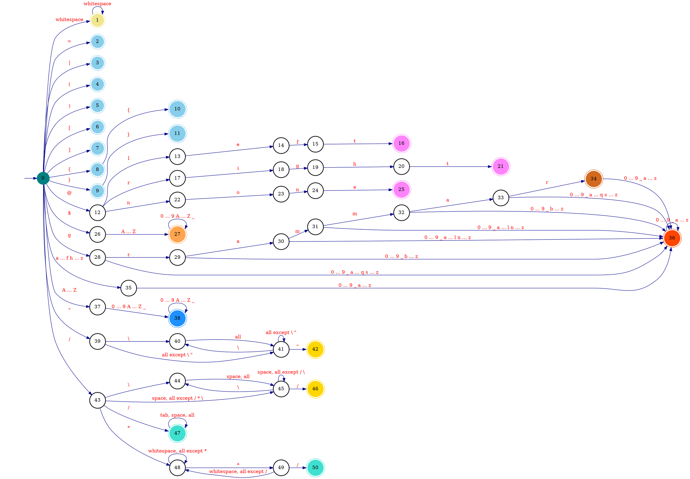

# Design

In this document, we go over some of the design decisions and rationals behind **Emerge**.

## Regular Expression

### Language Design

The following features are NOT included in the Emerge's Regular Expression language.
They seem unnecessary for the purpose of designing and defining tokens of a language.

  - Backreference
  - Unicode character class
  - Non-capturing group modifier `?:`
  - Anchors:
      - Word boundary `\b`
      - Non-word boundary`\B`
      - Start of string only `\A`
      - End of string only `\Z`
      - End of string only (not newline) `\z`
      - Previous match end `\G`

### Parser Design

For building a *Lexer* from an EBNF input, we need to parse regular expression patterns in the input,
so we can construct a [DFA](https://en.wikipedia.org/wiki/Deterministic_finite_automaton) for each pattern.
To this end, we need to first build a parser for regular expressions.

Building a regex parser is fairly simple and straightforward.
Implementing a separate *lexer* and *parser* for regular expressions is an inessential complexity
(i.e., whitespace characters do not need to be stripped out).

A simple parser for Emerge's regular expressions is built that takes care of terminal symbols.
This parser is implemented as a [Top-Down Parser](https://en.wikipedia.org/wiki/Top-down_parsing)
using [Parser Combinators](https://en.wikipedia.org/wiki/Parser_combinator).

A parser combinator is a **higher-order function** that accepts a *stream of input characters* and returns a *parsing result*.
Using a **functional programming** style, we can implement a context-free grammar (*Type-2* language)
as a single function that receives an input stream and returns an **abstract syntax tree**.

We will later use regular expression ASTs to construct DFAs needed for generating a lexer for an EBNF grammar.

## Extended Backus-Naur Form

### Language Design

The following terminal symbols are removed from the Emerge's EBNF language for simplicity and brevity.

  - Concatenation (`,`)
  - Termination (`;`)
  - Single quotation (`'`)

The Solidus (Slash) character (`/`) is added to the Emerge's EBNF language for defining regex patterns.

### Lexer Design


  - In the diagram above, `all` refers to characters in the `0x21` to `0x7E` range.
  - The DFA's final state is evaluated only after encountering an invalid input symbol,
    triggering an error for the next state.
    - States `8` and `10` are only assessed after an invalid symbol is processed,
      ensuring the DFA correctly identifies `{` or `{{` tokens.
    - Similarly, states `9` and `11` are evaluated only after an invalid symbol is encountered,
      allowing the DFA to correctly recognize `}` or `}}` tokens.
  - After evaluating and reading a lexeme from the input, the DFA resets its current state to `0`.
  - Tokens that begin with any prefix `grammar`, including `grammar` itself, are permitted.
  - `TOKEN` tokens must start with a lowercase letter (`a`–`z`).
  - `IDENT` tokens must start with an uppercase letter (`A`–`Z`).
  - The empty string `""` and empty regular expression `//` are not allowed.
  - Any character can be escaped using `/` within a string.
  - Any character can be escaped using `/` within a regular expression.
  - Empty comments `//` and `/**/` are allowed.

<details>
<summary>Lexer DFA Code</summary>

```go
package main

import (
	"fmt"

	. "github.com/moorara/algo/automata"
)

func main() {
	dfa := NewDFA(0, States{
		1, 2, 3, 4, 5, 6, 7, 8, 9, 10, 11, // WS, DEF, ALT, LPAREN, RPAREN, LBRACK, RBRACK, LBRACE, RBRACE, LLBRACE, RRBRACE
		16, 21, 25, // LASSOC, RASSOC, NOASSOC
		27,         // PREDEF
		34, 36, 38, // GRAMMER, IDENT, TOKEN
		42, 46, // STRING, REGEX
		47, 50, //  COMMENT, COMMENT
	})

	//====================< WHITESPACES >====================

	dfa.Add(0, '\t', 1)
	dfa.Add(0, '\n', 1)
	dfa.Add(0, '\v', 1)
	dfa.Add(0, '\f', 1)
	dfa.Add(0, '\r', 1)
	dfa.Add(0, ' ', 1)

	dfa.Add(1, '\t', 1)
	dfa.Add(1, '\n', 1)
	dfa.Add(1, '\v', 1)
	dfa.Add(1, '\f', 1)
	dfa.Add(1, '\r', 1)
	dfa.Add(1, ' ', 1)

	//====================< MISC TOKENS >====================

	dfa.Add(0, '=', 2)
	dfa.Add(0, '|', 3)
	dfa.Add(0, '(', 4)
	dfa.Add(0, ')', 5)
	dfa.Add(0, '[', 6)
	dfa.Add(0, ']', 7)
	dfa.Add(0, '{', 8)
	dfa.Add(0, '}', 9)
	dfa.Add(8, '{', 10)
	dfa.Add(9, '}', 11)

	//====================< ASSOCIATIVITY TOKENS >====================

	dfa.Add(0, '@', 12)

	dfa.Add(12, 'l', 13)
	dfa.Add(13, 'e', 14)
	dfa.Add(14, 'f', 15)
	dfa.Add(15, 't', 16)

	dfa.Add(12, 'r', 17)
	dfa.Add(17, 'i', 18)
	dfa.Add(18, 'g', 19)
	dfa.Add(19, 'h', 20)
	dfa.Add(20, 't', 21)

	dfa.Add(12, 'n', 22)
	dfa.Add(22, 'o', 23)
	dfa.Add(23, 'n', 24)
	dfa.Add(24, 'e', 25)

	//====================< PREDEF >====================

	dfa.Add(0, '$', 26)

	for _, r := range []rune("0123456789ABCDEFGHIJKLMNOPQRSTUVWXYZ_") {
		if 'A' <= r && r <= 'Z' {
			dfa.Add(26, Symbol(r), 27)
		}

		dfa.Add(27, Symbol(r), 27)
	}

	//====================< GRAMMER, IDENT >====================

	dfa.Add(0, 'g', 28)
	dfa.Add(28, 'r', 29)
	dfa.Add(29, 'a', 30)
	dfa.Add(30, 'm', 31)
	dfa.Add(31, 'm', 32)
	dfa.Add(32, 'a', 33)
	dfa.Add(33, 'r', 34)

	for _, r := range []rune("0123456789_abcdefghijklmnopqrstuvwxyz") {
		if 'a' <= r && r != 'g' {
			dfa.Add(0, Symbol(r), 35)
		}

		if r != 'r' {
			dfa.Add(28, Symbol(r), 36)
			dfa.Add(33, Symbol(r), 36)
		}

		if r != 'a' {
			dfa.Add(29, Symbol(r), 36)
			dfa.Add(32, Symbol(r), 36)
		}

		if r != 'm' {
			dfa.Add(30, Symbol(r), 36)
			dfa.Add(31, Symbol(r), 36)
		}

		dfa.Add(34, Symbol(r), 36)
		dfa.Add(35, Symbol(r), 36)
		dfa.Add(36, Symbol(r), 36)
	}

	//====================< TOKEN >====================

	for _, r := range []rune("0123456789ABCDEFGHIJKLMNOPQRSTUVWXYZ_") {
		if 'A' <= r && r <= 'Z' {
			dfa.Add(0, Symbol(r), 37)
		}

		dfa.Add(37, Symbol(r), 38)
		dfa.Add(38, Symbol(r), 38)
	}

	//====================< STRING >====================

	dfa.Add(0, '"', 39)
	dfa.Add(39, '\\', 40)

	for r := 0x21; r <= 0x7E; r++ {
		dfa.Add(40, Symbol(r), 41)

		if r != '"' && r != '\\' {
			dfa.Add(39, Symbol(r), 41)
			dfa.Add(41, Symbol(r), 41)
		}
	}

	dfa.Add(41, '\\', 40)
	dfa.Add(41, '"', 42)

	//====================< REGEX >====================

	dfa.Add(0, '/', 43)
	dfa.Add(43, '\\', 44)

	for r := 0x20; r <= 0x7E; r++ {
		dfa.Add(44, Symbol(r), 45)

		if r != '/' && r != '\\' && r != '*' {
			dfa.Add(43, Symbol(r), 45)
		}

		if r != '/' && r != '\\' {
			dfa.Add(45, Symbol(r), 45)
		}
	}

	dfa.Add(45, '\\', 44)
	dfa.Add(45, '/', 46)

	//====================< SINGLE-LINE COMMENT >====================

	dfa.Add(43, '/', 47)

	dfa.Add(47, '\t', 47)
	for r := 0x20; r <= 0x7E; r++ {
		dfa.Add(47, Symbol(r), 47)
	}

	//====================< MULTI-LINE COMMENT >====================

	dfa.Add(43, '*', 48)

	for _, r := range []rune("\t\n\r") {
		dfa.Add(48, Symbol(r), 48)
		dfa.Add(49, Symbol(r), 48)
	}

	for r := 0x20; r <= 0x7E; r++ {
		if r != '*' {
			dfa.Add(48, Symbol(r), 48)
		}

		if r != '/' {
			dfa.Add(49, Symbol(r), 48)
		}
	}

	dfa.Add(48, '*', 49)
	dfa.Add(49, '/', 50)

	//====================< END >====================

	fmt.Println(dfa.DOT())
}
```


</details>

#### Input Buffer

We employ the *two-buffer* scheme explained [here](./2-lexer_theory.md#input-buffering).
The two buffers are implemented as one buffer divided into two halves.

### Parser Design

TBD

## Resources

  - [Extended Backus–Naur Form](https://en.wikipedia.org/wiki/Extended_Backus%E2%80%93Naur_form)
  - [Parser Combinator](https://en.wikipedia.org/wiki/Parser_combinator)
  - [Let's Build a Regex Engine](https://kean.blog/post/lets-build-regex)
    - https://github.com/kean/Regex
