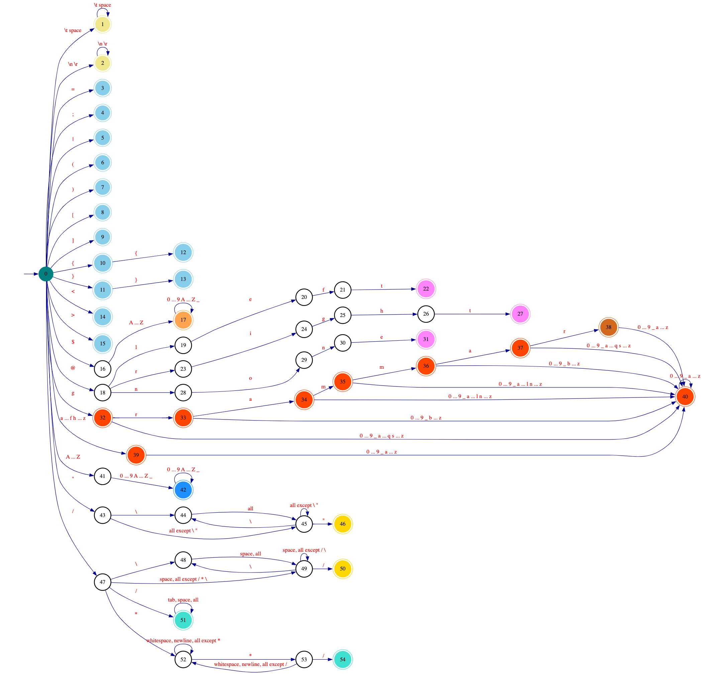

# Design

In this document, we go over some of the design decisions and rationals behind **Emerge**.

## Regular Expression

### Language Design

The following features are NOT included in the Emerge's Regular Expression language.
They seem unnecessary for the purpose of designing and defining tokens of a language.

  - Backreference
  - Unicode character class
  - Non-capturing group modifier `?:`
  - Anchors:
      - Word boundary `\b`
      - Non-word boundary`\B`
      - Start of string only `\A`
      - End of string only `\Z`
      - End of string only (not newline) `\z`
      - Previous match end `\G`

### Parser Design

For building a *Lexer* from an EBNF input, we need to parse regular expression patterns in the input,
so we can construct a [DFA](https://en.wikipedia.org/wiki/Deterministic_finite_automaton) for each pattern.
To this end, we need to first build a parser for regular expressions.

Building a regex parser is fairly simple and straightforward.
Implementing a separate *lexer* and *parser* for regular expressions is an inessential complexity
(i.e., whitespace characters do not need to be stripped out).

A simple parser for Emerge's regular expressions is built that takes care of terminal symbols.
This parser is implemented as a [Top-Down Parser](https://en.wikipedia.org/wiki/Top-down_parsing)
using [Parser Combinators](https://en.wikipedia.org/wiki/Parser_combinator).

A parser combinator is a **higher-order function** that accepts a *stream of input characters* and returns a *parsing result*.
Using a **functional programming** style, we can implement a context-free grammar (*Type-2* language)
as a single function that receives an input stream and returns an **abstract syntax tree**.

We will later use regular expression ASTs to construct DFAs needed for generating a lexer for an EBNF grammar.

## Extended Backus-Naur Form

### Language Design

The following terminal symbols are removed from the Emerge's EBNF language for simplicity and brevity.

  - Concatenation (`,`)
  - Termination (`;`)
  - Single quotation (`'`)

The Solidus (Slash) character (`/`) is added to the Emerge's EBNF language for defining regex patterns.

### Lexer Design



  - In the diagram above, `all` refers to characters in the `0x21` to `0x7E` range.
  - The DFA's final state is evaluated only after encountering an invalid input symbol,
    triggering an error for the next state.
    - States `8` and `10` are only assessed after an invalid symbol is processed,
      ensuring the DFA correctly identifies `{` or `{{` tokens.
    - Similarly, states `9` and `11` are evaluated only after an invalid symbol is encountered,
      allowing the DFA to correctly recognize `}` or `}}` tokens.
  - After evaluating and reading a lexeme from the input, the DFA resets its current state to `0`.
  - Tokens that begin with any prefix `grammar`, including `grammar` itself, are permitted.
  - `TOKEN` tokens must start with a lowercase letter (`a`–`z`).
  - `IDENT` tokens must start with an uppercase letter (`A`–`Z`).
  - The empty string `""` and empty regular expression `//` are not allowed.
  - Any character can be escaped using `/` within a string.
  - Any character can be escaped using `/` within a regular expression.
  - Empty comments `//` and `/**/` are allowed.

<details>
<summary>Lexer DFA Code</summary>

```go
package main

import (
	"fmt"

	. "github.com/moorara/algo/automata"
)

func main() {
	dfa := NewDFA(0, States{
		1, 2,
		3, 4, 5, 6, 7, 8, 9, 10, 11, 12, 13, 14, 15,
		17,
		22, 27, 31,
		38, 40, 42,
		46, 50,
		51, 54,
	})

	//====================< WHITESPACES >====================

	dfa.Add(0, '\t', 1)
	dfa.Add(0, ' ', 1)

	dfa.Add(1, '\t', 1)
	dfa.Add(1, ' ', 1)

	//====================< NEWLINES >====================

	dfa.Add(0, '\n', 2)
	dfa.Add(0, '\r', 2)

	dfa.Add(2, '\n', 2)
	dfa.Add(2, '\r', 2)

	//====================< MISC TOKENS >====================

	dfa.Add(0, '=', 3)
	dfa.Add(0, ';', 4)
	dfa.Add(0, '|', 5)
	dfa.Add(0, '(', 6)
	dfa.Add(0, ')', 7)
	dfa.Add(0, '[', 8)
	dfa.Add(0, ']', 9)
	dfa.Add(0, '{', 10)
	dfa.Add(0, '}', 11)
	dfa.Add(10, '{', 12)
	dfa.Add(11, '}', 13)
	dfa.Add(0, '<', 14)
	dfa.Add(0, '>', 15)

	//====================< PREDEF >====================

	dfa.Add(0, '$', 16)

	for _, r := range "0123456789ABCDEFGHIJKLMNOPQRSTUVWXYZ_" {
		if 'A' <= r && r <= 'Z' {
			dfa.Add(16, Symbol(r), 17)
		}

		dfa.Add(17, Symbol(r), 17)
	}

	//====================< ASSOCIATIVITY TOKENS >====================

	dfa.Add(0, '@', 18)

	dfa.Add(18, 'l', 19)
	dfa.Add(19, 'e', 20)
	dfa.Add(20, 'f', 21)
	dfa.Add(21, 't', 22)

	dfa.Add(18, 'r', 23)
	dfa.Add(23, 'i', 24)
	dfa.Add(24, 'g', 25)
	dfa.Add(25, 'h', 26)
	dfa.Add(26, 't', 27)

	dfa.Add(18, 'n', 28)
	dfa.Add(28, 'o', 29)
	dfa.Add(29, 'n', 30)
	dfa.Add(30, 'e', 31)

	//====================< GRAMMER, IDENT >====================

	dfa.Add(0, 'g', 32)
	dfa.Add(32, 'r', 33)
	dfa.Add(33, 'a', 34)
	dfa.Add(34, 'm', 35)
	dfa.Add(35, 'm', 36)
	dfa.Add(36, 'a', 37)
	dfa.Add(37, 'r', 38)

	for _, r := range "0123456789_abcdefghijklmnopqrstuvwxyz" {
		if 'a' <= r && r != 'g' {
			dfa.Add(0, Symbol(r), 39)
		}

		if r != 'r' {
			dfa.Add(32, Symbol(r), 40)
			dfa.Add(37, Symbol(r), 40)
		}

		if r != 'a' {
			dfa.Add(33, Symbol(r), 40)
			dfa.Add(36, Symbol(r), 40)
		}

		if r != 'm' {
			dfa.Add(34, Symbol(r), 40)
			dfa.Add(35, Symbol(r), 40)
		}

		dfa.Add(38, Symbol(r), 40)
		dfa.Add(39, Symbol(r), 40)
		dfa.Add(40, Symbol(r), 40)
	}

	//====================< TOKEN >====================

	for _, r := range "0123456789ABCDEFGHIJKLMNOPQRSTUVWXYZ_" {
		if 'A' <= r && r <= 'Z' {
			dfa.Add(0, Symbol(r), 41)
		}

		dfa.Add(41, Symbol(r), 42)
		dfa.Add(42, Symbol(r), 42)
	}

	//====================< STRING >====================

	dfa.Add(0, '"', 43)
	dfa.Add(43, '\\', 44)

	for r := 0x21; r <= 0x7E; r++ {
		dfa.Add(44, Symbol(r), 45)

		if r != '"' && r != '\\' {
			dfa.Add(43, Symbol(r), 45)
			dfa.Add(45, Symbol(r), 45)
		}
	}

	dfa.Add(45, '\\', 44)
	dfa.Add(45, '"', 46)

	//====================< REGEX >====================

	dfa.Add(0, '/', 47)
	dfa.Add(47, '\\', 48)

	for r := 0x20; r <= 0x7E; r++ {
		dfa.Add(48, Symbol(r), 49)

		if r != '/' && r != '\\' && r != '*' {
			dfa.Add(47, Symbol(r), 49)
		}

		if r != '/' && r != '\\' {
			dfa.Add(49, Symbol(r), 49)
		}
	}

	dfa.Add(49, '\\', 48)
	dfa.Add(49, '/', 50)

	//====================< SINGLE-LINE COMMENT >====================

	dfa.Add(47, '/', 51)

	dfa.Add(51, '\t', 51)
	for r := 0x20; r <= 0x7E; r++ {
		dfa.Add(51, Symbol(r), 51)
	}

	//====================< MULTI-LINE COMMENT >====================

	dfa.Add(47, '*', 52)

	for _, r := range "\t\n\r" {
		dfa.Add(52, Symbol(r), 52)
		dfa.Add(53, Symbol(r), 52)
	}

	for r := 0x20; r <= 0x7E; r++ {
		if r != '*' {
			dfa.Add(52, Symbol(r), 52)
		}

		if r != '/' {
			dfa.Add(53, Symbol(r), 52)
		}
	}

	dfa.Add(52, '*', 53)
	dfa.Add(53, '/', 54)

	//====================< END >====================

	fmt.Println(dfa.DOT())
}
```


</details>

#### Input Buffer

A *two-buffer* scheme, explained [here](./2-lexer_theory.md#input-buffering), is employed for implementing the EBNF lexer.
The two buffers are implemented as one buffer divided into two halves.

### Parser Design

The EBNF parser is implemented as a [bottom-up](./3-parser_theory.md#bottom-up-parsing)
[LALR](./3-parser_theory.md#lalr-parsers) parser, ensuring efficient and deterministic parsing.

The parsing table for EBNF is generated using this
[algorithm](https://pkg.go.dev/github.com/moorara/algo/parser/lr/lookahead#BuildParsingTable)
based on the grammar and precedence rules defined [here](./4-definitions.md#extended-backus-naur-form).

To implement an LR parser, the grammar must be in `LR(1)` form.
LR(1) grammars require minimal transformations, often closely resembling natural language structures.
[Ambiguous grammars](./3-parser_theory.md#ambiguous-grammars) can also be handled using precedence rules.

The Emerge parser generator also produces `LALR` parsers for the same reasons mentioned above,
balancing efficiency and expressiveness.

For error handling, the [panic-mode](./3-parser_theory.md#panic-mode-recovery) error recovery method is used
due to its simplicity and adaptability to any arbitrary grammar.

The generated parser offers three primary modes of operation, similar to the examples
[here](https://pkg.go.dev/github.com/moorara/algo/parser/lr/lookahead#pkg-examples):

  - **Tokenization and Production Extraction**: Outputs tokens and their corresponding productions.
  - **Abstract Syntax Tree (AST) Construction**: Builds an AST based on the grammar's production rules.
  - **Rule-based Evaluation and Direct Translation**: Evaluates production rules
    alongside previously computed values, enabling direct translation of the parsed input.

## Resources

  - [Extended Backus–Naur Form](https://en.wikipedia.org/wiki/Extended_Backus%E2%80%93Naur_form)
  - [Parser Combinator](https://en.wikipedia.org/wiki/Parser_combinator)
  - [Let's Build a Regex Engine](https://kean.blog/post/lets-build-regex)
    - https://github.com/kean/Regex
