# Design of Emerge

In this document, we go over some of the design decisions and rationals behind **Emerge**.

## Regular Expression

### Language Design

The following features are NOT included in the Emerge's Regular Expression language.
They seem unnecessary for the purpose of designing and defining tokens of a language.

  - Backreference
  - Non-capturing group modifier `?:`
  - Lookarounds `?=` `?!` `?<=` `?<!`
  - Anchors:
      - Word boundary `\b`
      - Non-word boundary`\B`
      - Start of string only `\A`
      - End of string only `\Z`
      - End of string only (not newline) `\z`
      - Previous match end `\G`

### Parser Design

For building a *Lexer* from an EBNF input, we need to parse regular expression patterns in the input,
so we can construct a [DFA](https://en.wikipedia.org/wiki/Deterministic_finite_automaton) for each pattern.
To this end, we need to first build a parser for regular expressions.

Building a regex parser is fairly simple and straightforward.
Implementing a separate *lexer* and *parser* for regular expressions is an inessential complexity
(i.e., whitespace characters do not need to be stripped out).

A simple parser for Emerge's regular expressions is built that takes care of terminal symbols.
This parser is implemented as a [Top-Down Parser](https://en.wikipedia.org/wiki/Top-down_parsing)
using [Parser Combinators](https://en.wikipedia.org/wiki/Parser_combinator).

A parser combinator is a **higher-order function** that accepts a *stream of input characters* and returns a *parsing result*.
Using a **functional programming** style, we can implement a context-free grammar (*Type-2* language)
as a single function that receives an input stream and returns an **abstract syntax tree**.

We will later use regular expression ASTs to construct DFAs needed for generating a lexer for an EBNF grammar.

## Extended Backus-Naur Form

### Language Design

The following terminal symbols are removed from the Emerge's EBNF language for simplicity and brevity.

  - Concatenation (`,`)
  - Termination (`;`)
  - Single quotation (`'`)

The Solidus (Slash) character (`/`) is added to the Emerge's EBNF language for defining regex patterns.

### Lexer Design

  - In the diagram above, `Unicode` covers all characters from `0x00` to `0x10FFFF`.
  - The DFA's final state is evaluated only after encountering an invalid input symbol,
    triggering an error for the next state.
      - States `10` and `12` are checked only after that invalid symbol, ensuring the DFA
        correctly distinguishes `{` from `{{`.
      - Likewise, states `11` and `13` are checked only after an invalid symbol, so the DFA
        correctly recognizes `}` vs. `}}`.
  - After emitting a lexeme, the DFA resets to state `0`.
  - `IDENT` tokens must start with an uppercase letter (`a`–`z`).
  - `TOKEN` tokens must start with a lowercase letter (`A`–`Z`).
  - String constraints:
      - The empty string `""` is allowed.
      - The lexer recognizes only these escape sequences:
          - `\\` `\'` `\"` `\t` `\n` `\r`
          - `\x[0-9A-Fa-f]{2}`
          - `\u[0-9A-Fa-f]{4}`
          - `\U[0-9A-Fa-f]{8}`
  - Regular expression constraints:
      - The empty regex is not allowed (`//` starts a single-line comment).
      - After a backslash, any character may be escaped
        (the regex parser later validates which escapes are legal).
  - Comment constraints:
      - Empty comments `//` and `/**/` are allowed.

```dot
digraph "DFA" {
  rankdir=LR;
  concentrate=false;
  node [shape=circle];
  edge [color=darkblue fontcolor=red];

  start [style=invis];

  0 [label="0" shape=circle style=filled color=teal];
  1 [label="1" shape=doublecircle style=filled color=khaki];
  2 [label="2" shape=doublecircle style=filled color=khaki];
  3 [label="3" shape=doublecircle style=filled color=skyblue];
  4 [label="4" shape=doublecircle style=filled color=skyblue];
  5 [label="5" shape=doublecircle style=filled color=skyblue];
  6 [label="6" shape=doublecircle style=filled color=skyblue];
  7 [label="7" shape=doublecircle style=filled color=skyblue];
  8 [label="8" shape=doublecircle style=filled color=skyblue];
  9 [label="9" shape=doublecircle style=filled color=skyblue];
  10 [label="10" shape=doublecircle style=filled color=skyblue];
  11 [label="11" shape=doublecircle style=filled color=skyblue];
  12 [label="12" shape=doublecircle style=filled color=skyblue];
  13 [label="13" shape=doublecircle style=filled color=skyblue];
  14 [label="14" shape=doublecircle style=filled color=skyblue];
  15 [label="15" shape=doublecircle style=filled color=skyblue];
  16 [label="16" shape=circle];
  17 [label="17" shape=doublecircle style=filled color=tan1];
  18 [label="18" shape=circle];
  19 [label="19" shape=circle];
  20 [label="20" shape=circle];
  21 [label="21" shape=circle];
  22 [label="22" shape=doublecircle style=filled color=orchid1];
  23 [label="23" shape=circle];
  24 [label="24" shape=circle];
  25 [label="25" shape=circle];
  26 [label="26" shape=circle];
  27 [label="27" shape=doublecircle style=filled color=orchid1];
  28 [label="28" shape=circle];
  29 [label="29" shape=circle];
  30 [label="30" shape=circle];
  31 [label="31" shape=doublecircle style=filled color=orchid1];
  32 [label="32" shape=doublecircle style=filled color=orangered];
  33 [label="33" shape=doublecircle style=filled color=orangered];
  34 [label="34" shape=doublecircle style=filled color=orangered];
  35 [label="35" shape=doublecircle style=filled color=orangered];
  36 [label="36" shape=doublecircle style=filled color=orangered];
  37 [label="37" shape=doublecircle style=filled color=orangered];
  38 [label="38" shape=doublecircle style=filled color=chocolate];
  39 [label="39" shape=doublecircle style=filled color=orangered];
  40 [label="40" shape=doublecircle style=filled color=dodgerblue];
  41 [label="41" shape=circle];
  42 [label="42" shape=circle];
  43 [label="43" shape=circle];
  44 [label="44" shape=circle];
  45 [label="45" shape=circle];
  46 [label="46" shape=circle];
  47 [label="47" shape=circle];
  48 [label="48" shape=circle];
  49 [label="49" shape=circle];
  50 [label="50" shape=circle];
  51 [label="51" shape=circle];
  52 [label="52" shape=circle];
  53 [label="53" shape=circle];
  54 [label="54" shape=circle];
  55 [label="55" shape=circle];
  56 [label="56" shape=circle];
  57 [label="57" shape=circle];
  58 [label="58" shape=circle];
  59 [label="59" shape=circle];
  60 [label="60" shape=circle];
  61 [label="61" shape=doublecircle style=filled color=gold];
  62 [label="62" shape=circle];
  63 [label="63" shape=circle];
  64 [label="64" shape=circle];
  65 [label="65" shape=doublecircle style=filled color=gold];
  66 [label="66" shape=doublecircle style=filled color=turquoise];
  67 [label="67" shape=circle];
  68 [label="68" shape=circle];
  69 [label="69" shape=doublecircle style=filled color=turquoise];

  start -> 0 [];

  0 -> 1 [label="\\t, SP"];
  0 -> 2 [label="\\n, \\r"];
  0 -> 3 [label="="];
  0 -> 4 [label=";"];
  0 -> 5 [label="|"];
  0 -> 6 [label="("];
  0 -> 7 [label=")"];
  0 -> 8 [label="["];
  0 -> 9 [label="]"];
  0 -> 10 [label="{"];
  0 -> 11 [label="}"];
  0 -> 14 [label="<"];
  0 -> 15 [label=">"];
  0 -> 16 [label="$"];
  0 -> 18 [label="@"];
  0 -> 32 [label="g"];
  0 -> 39 [label="[a..f], [h..z]" color=darkgreen];
  0 -> 40 [label="[A..Z]"];
  0 -> 41 [label="\""];
  0 -> 62 [label="/"];
  1 -> 1 [label="\\t, SP"];
  2 -> 2 [label="\\n, \\r"];
  10 -> 12 [label="{"];
  11 -> 13 [label="}"];
  16 -> 17 [label="[A..Z]"];
  17 -> 17 [label="[0..9], [A..Z], _"];
  18 -> 19 [label="l"];
  18 -> 23 [label="r"];
  18 -> 28 [label="n"];
  19 -> 20 [label="e"];
  20 -> 21 [label="f"];
  21 -> 22 [label="t"];
  23 -> 24 [label="i"];
  24 -> 25 [label="g"];
  25 -> 26 [label="h"];
  26 -> 27 [label="t"];
  28 -> 29 [label="o"];
  29 -> 30 [label="n"];
  30 -> 31 [label="e"];
  32 -> 33 [label="r"];
  32 -> 39 [label="[0..9], _, [a..q], [s..z]" color=darkgreen];
  33 -> 34 [label="a"];
  33 -> 39 [label="[0..9], _, [b..z]" color=darkgreen];
  34 -> 35 [label="m"];
  34 -> 39 [label="[0..9], _, [a..l], [n..z]" color=darkgreen];
  35 -> 36 [label="m"];
  35 -> 39 [label="[0..9], _, [a..l], [n..z]" color=darkgreen];
  36 -> 37 [label="a"];
  36 -> 39 [label="[0..9], _, [b..z]" color=darkgreen];
  37 -> 38 [label="r"];
  37 -> 39 [label="[0..9], _, [a..q], [s..z]" color=darkgreen];
  38 -> 39 [label="[0..9], _, [a..z]" color=darkgreen];
  39 -> 39 [label="[0..9], _, [a..z]" color=darkgreen];
  40 -> 40 [label="[0..9], [A..Z], _"];
  41 -> 41 [label="All Unicode except \\ \"" color=darkcyan];
  41 -> 42 [label="\\" color=darkorange];
  41 -> 61 [label="\"" color=darkgreen];
  42 -> 43 [label="\", ', \\, n, r, t"];
  42 -> 44 [label="x"];
  42 -> 47 [label="u"];
  42 -> 52 [label="U"];
  43 -> 41 [label="All Unicode except \\ \"" color=darkcyan];
  43 -> 42 [label="\\" color=darkorange];
  43 -> 61 [label="\"" color=darkgreen];
  44 -> 45 [label="[0..9], [A..F], [a..f]"];
  45 -> 46 [label="[0..9], [A..F], [a..f]"];
  46 -> 41 [label="All Unicode except \\ \"" color=darkcyan];
  46 -> 42 [label="\\" color=darkorange];
  46 -> 61 [label="\"" color=darkgreen];
  47 -> 48 [label="[0..9], [A..F], [a..f]"];
  48 -> 49 [label="[0..9], [A..F], [a..f]"];
  49 -> 50 [label="[0..9], [A..F], [a..f]"];
  50 -> 51 [label="[0..9], [A..F], [a..f]"];
  51 -> 41 [label="All Unicode except \\ \"" color=darkcyan];
  51 -> 42 [label="\\" color=darkorange];
  51 -> 61 [label="\"" color=darkgreen];
  52 -> 53 [label="[0..9], [A..F], [a..f]"];
  53 -> 54 [label="[0..9], [A..F], [a..f]"];
  54 -> 55 [label="[0..9], [A..F], [a..f]"];
  55 -> 56 [label="[0..9], [A..F], [a..f]"];
  56 -> 57 [label="[0..9], [A..F], [a..f]"];
  57 -> 58 [label="[0..9], [A..F], [a..f]"];
  58 -> 59 [label="[0..9], [A..F], [a..f]"];
  59 -> 60 [label="[0..9], [A..F], [a..f]"];
  60 -> 41 [label="All Unicode except \\ \"" color=darkcyan];
  60 -> 42 [label="\\" color=darkorange];
  60 -> 61 [label="\"" color=darkgreen];
  62 -> 63 [label="\\" color=darkorange];
  62 -> 64 [label="All Unicode except / \\ *" color=darkgreen];
  62 -> 66 [label="/"];
  62 -> 67 [label="*"];
  63 -> 64 [label="All Unicode" color=darkorange];
  64 -> 63 [label="\\" color=darkorange];
  64 -> 64 [label="All Unicode except / \\" color=darkgreen];
  64 -> 65 [label="/"];
  66 -> 66 [label="All Unicode except \\n \\v \\f \\r" color=darkgreen];
  67 -> 67 [label="All Unicode except *" color=darkgreen];
  67 -> 68 [label="*"];
  68 -> 67 [label="All Unicode except * /" color=darkgreen];
  68 -> 68 [label="*"];
  68 -> 69 [label="/"];
}
```

Lexer DFA Code

#### Input Buffer

A *two-buffer* scheme, explained [here](./3-lexer_theory.md#input-buffering), is employed for implementing the EBNF lexer.
The two buffers are implemented as one buffer divided into two halves.

### Parser Design

The EBNF parser is implemented as a [bottom-up](./4-parser_theory.md#bottom-up-parsing)
[LALR](./4-parser_theory.md#lalr-parsers) parser, ensuring efficient and deterministic parsing.

The parsing table for EBNF is generated using this
[algorithm](https://pkg.go.dev/github.com/moorara/algo/parser/lr/lookahead#BuildParsingTable)
based on the grammar and precedence rules defined [here](./5-definitions.md#extended-backus-naur-form).

To implement an LR parser, the grammar must be in `LR(1)` form.
LR(1) grammars require minimal transformations, often closely resembling natural language structures.
[Ambiguous grammars](./4-parser_theory.md#ambiguous-grammars) can also be handled using precedence rules.

The Emerge parser generator also produces `LALR` parsers for the same reasons mentioned above,
balancing efficiency and expressiveness.

For error handling, the [panic-mode](./4-parser_theory.md#panic-mode-recovery) error recovery method is used
due to its simplicity and adaptability to any arbitrary grammar.

## Resources

  - [Extended Backus–Naur Form](https://en.wikipedia.org/wiki/Extended_Backus%E2%80%93Naur_form)
  - [Parser Combinator](https://en.wikipedia.org/wiki/Parser_combinator)
  - [Regular-Expressions.info](https://www.regular-expressions.info)
  - [Let's Build a Regex Engine](https://kean.blog/post/lets-build-regex)
    - https://github.com/kean/Regex
